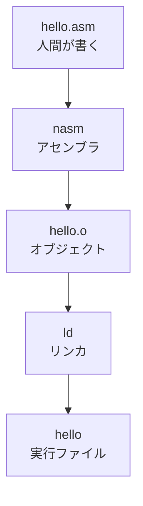

## はじめに

アセンブリは、**CPUに近い言葉**です。

小学生っぽく言うと、こうです。

```plaintext
人間のお願い
  ↓
プログラム
  ↓
アセンブリ
  ↓
機械語
  ↓
CPUが動く
```

この記事では、全部を細かくやりすぎず、

```plaintext
1. アセンブリの種類
2. アセンブリの書き方
3. x86の世界
```

を、図多めで紹介します。

---

## まず全体像


アセンブリは、ざっくり言うとここです。

```plaintext
C言語など
  ↓ コンパイル
アセンブリ
  ↓ アセンブル
機械語
```

例です。

```c
int x = 1 + 2;
```

CPUに近づくと、こういう形になります。

```asm
mov eax, 1
add eax, 2
```

もっとCPUに近づくと、ただのバイト列です。

```plaintext
mov eax, 1
   ↓
B8 01 00 00 00
```

---

## アセンブリとは何か

アセンブリは、**機械語を人間が読めるようにしたもの**です。

```plaintext
機械語
10111000 00000001 00000000 00000000 00000000

人間には読みづらい
        ↓
アセンブリ
mov eax, 1

少し読める
```

CPUは、命令を1つずつ実行します。

```plaintext
CPUの1歩

┌──────────────┐
│ 命令を取る    │ fetch
├──────────────┤
│ 命令を読む    │ decode
├──────────────┤
│ 命令を実行    │ execute
└──────────────┘
```

アセンブリは、この「命令」を書く言葉です。

---

## アセンブリは1種類ではない

ここが大事です。

> アセンブリは、CPUごとに違います。

```plaintext
アセンブリ
├─ x86 / x86-64
├─ ARM / AArch64
├─ RISC-V
├─ MIPS
├─ AVR
└─ ほかにもたくさん
```

CPUが違うと、命令の形も変わります。

```plaintext
CPU = ゲーム機
命令 = コントローラーのボタン

ゲーム機が違うと、ボタンの意味も違う
```

---

## 種類その1：CPU・ISAによる違い

ISAは、CPUの「命令メニュー」です。

```plaintext
ISA = Instruction Set Architecture
    = CPUが理解できる命令のセット
```

```plaintext
CPUさんが読めるメニュー

┌───────────────┐
│ mov  入れる    │
│ add  足す      │
│ sub  引く      │
│ cmp  比べる    │
│ jmp  飛ぶ      │
└───────────────┘
```

| 種類 | よく見る場所 | イメージ |
|---|---|---|
| x86 / x86-64 | Windows PC、Linux PC、サーバ | パソコンの王道 |
| ARM / AArch64 | スマホ、Apple Silicon、組み込み | 省電力で強い |
| RISC-V | 研究、教育、組み込み | オープンなCPU命令セット |
| MIPS | 教育、古い機器 | 教科書で見やすい |
| AVR | Arduinoなど | 小さいマイコン |

---

## 種類その2：書き方の流派

同じx86でも、書き方に流派があります。

```plaintext
x86アセンブリ
├─ Intel記法
│  └─ NASM / MASM など
└─ AT&T記法
   └─ GAS など
```

同じ意味でも見た目が違います。

### Intel記法

```asm
mov rax, 1
add rax, 2
```

読み方です。

```plaintext
mov rax, 1
    │    └─ 材料
    └──── 目的地

rax に 1 を入れる
```

### AT&T記法

```asm
movq $1, %rax
addq $2, %rax
```

読み方です。

```plaintext
movq $1, %rax
     │    └─ 目的地
     └──── 材料

1 を rax に入れる
```

違いを図にするとこうです。

```plaintext
Intel記法
命令  目的地, 材料
mov   rax,   1

AT&T記法
命令  材料, 目的地
movq  $1,  %rax
```

この記事では、見やすいので **Intel記法** を使います。

---

## 種類その3：OSやファイル形式の違い

CPUだけでなく、OSでも変わります。

```plaintext
同じx86-64でも

Linux  → ELF
Windows → PE
macOS  → Mach-O
```

```plaintext
アセンブリを書く
  ↓
オブジェクトファイル
  ↓
実行ファイル
  ↓
OSが読み込む
```

図にするとこうです。


---

## アセンブリの基本の書き方

形はだいたいこうです。

```plaintext
ラベル:
    命令  目的地, 材料   ; コメント
```

実例です。

```asm
start:
    mov rax, 1      ; rax に 1 を入れる
    add rax, 2      ; rax に 2 を足す
```

分解します。

```plaintext
start:
│
└─ ラベル
   ここに名前をつける

    mov rax, 1
    │   │    │
    │   │    └─ 材料
    │   └────── 目的地
    └────────── 命令
```

---

## 命令とディレクティブ

アセンブリには、大きく2つあります。

```plaintext
アセンブリの行
├─ 命令
│  └─ CPUが実行する
└─ ディレクティブ
   └─ アセンブラへの指示
```

### 命令

```asm
mov rax, 10
add rax, 20
```

CPUが実行します。

```plaintext
rax = 10
rax = rax + 20
```

### ディレクティブ

```asm
section .text
global _start
```

CPUの命令ではありません。

```plaintext
アセンブラさんへ

section .text  → ここからコード置き場です
global _start  → _startを外から見える名前にしてください
```

---

## よく出る置き場

```plaintext
プログラムの中

┌──────────────┐
│ .text        │ 命令を置く
├──────────────┤
│ .data        │ 最初から値があるデータ
├──────────────┤
│ .bss         │ あとで使う空のデータ
└──────────────┘
```

例です。

```asm
section .data
msg db "Hello", 10

section .text
global _start
_start:
    ; ここに命令を書く
```

---

## CPUの中身をざっくり見る

CPUの中には、小さなメモ帳があります。

それが **レジスタ** です。

```plaintext
CPU
┌──────────────────────────┐
│ レジスタ                  │
│ ┌────┐ ┌────┐ ┌────┐      │
│ │RAX │ │RBX │ │RCX │ ...  │
│ └────┘ └────┘ └────┘      │
│                          │
│ 計算するところ            │
└──────────────────────────┘
```

メモリは、外にある大きな棚です。

```plaintext
メモリ
┌────────────┐
│ address 0  │
├────────────┤
│ address 1  │
├────────────┤
│ address 2  │
├────────────┤
│ ...        │
└────────────┘
```

イメージです。

```plaintext
レジスタ = ポケット
メモリ   = 大きな棚

ポケットは速い
棚は大きい
```

---

## x86とは

x86は、PCでよく使われるCPU命令の世界です。

```plaintext
x86ファミリー
├─ 16-bit x86
├─ 32-bit x86
└─ 64-bit x86-64
```

今のPCでは、だいたい **x86-64** をよく見ます。

この記事の例も、基本は **x86-64** です。

---

## x86-64のレジスタ

よく見るレジスタです。

```plaintext
汎用レジスタ

┌─────┬────────────────────┐
│ RAX │ 計算結果によく使う │
│ RBX │ 汎用               │
│ RCX │ カウンタによく使う │
│ RDX │ データによく使う   │
│ RSI │ 文字列/配列の元    │
│ RDI │ 文字列/配列の先    │
│ RBP │ スタックの基準     │
│ RSP │ スタックの先頭     │
│ R8  │ 汎用               │
│ ... │ ...                │
│ R15 │ 汎用               │
└─────┴────────────────────┘
```

一番大事なのは、まずこの3つです。

```plaintext
RAX = 結果を入れがち
RSP = スタックの現在地
RBP = 関数の基準点に使いがち
```

---

## レジスタのサイズ

x86は、同じレジスタをサイズ違いで呼べます。

```plaintext
RAX 64bit
┌────────────────────────────────┐
│              RAX               │
└────────────────────────────────┘
                 EAX 32bit
                 ┌──────────────┐
                 │     EAX      │
                 └──────────────┘
                         AX 16bit
                         ┌──────┐
                         │  AX  │
                         └──────┘
                         AH  AL
                         ┌──┬──┐
                         │AH│AL│
                         └──┴──┘
```

サイズ名もよく出ます。

```plaintext
byte  = 8 bit
word  = 16 bit
dword = 32 bit
qword = 64 bit
```

例です。

```asm
mov al,  1      ; 8bit
mov ax,  1      ; 16bit
mov eax, 1      ; 32bit
mov rax, 1      ; 64bit
```

---

## x86命令の読み方

基本形です。

```plaintext
命令  目的地, 材料
```

```asm
mov rax, 5
```

```plaintext
rax = 5
```

```asm
add rax, 3
```

```plaintext
rax = rax + 3
```

```asm
sub rax, 2
```

```plaintext
rax = rax - 2
```

---

## mov：入れる

```asm
mov rax, 10
```

```plaintext
実行前
RAX = ?

実行後
RAX = 10
```

図です。

```plaintext
10 ───────▶ RAX
```

---

## add：足す

```asm
mov rax, 10
add rax, 5
```

```plaintext
実行前
RAX = 10

add rax, 5

実行後
RAX = 15
```

```plaintext
RAXの中身

10
│
│ + 5
▼
15
```

---

## sub：引く

```asm
mov rax, 10
sub rax, 3
```

```plaintext
RAX = 10 - 3
RAX = 7
```

---

## imul：かけ算

```asm
mov rax, 6
imul rax, 7
```

```plaintext
RAX = 6 * 7
RAX = 42
```

---

## cmp：比べる

```asm
cmp rax, rbx
```

これは、見た目は引き算っぽいです。

```plaintext
rax - rbx を考える
でも結果は保存しない

かわりに FLAG を変える
```

```plaintext
cmp rax, rbx
      │    │
      │    └─ 右
      └────── 左

左と右を比べる
```

---

## FLAG：CPUのメモ

cmpの結果は、FLAGに入ります。

```plaintext
FLAGS
┌────┬────────────────────┐
│ ZF │ 0になった？         │
│ SF │ マイナス？          │
│ CF │ 桁あふれ/借りた？   │
│ OF │ 符号付きであふれた？│
└────┴────────────────────┘
```

例です。

```asm
mov rax, 5
cmp rax, 5
```

```plaintext
5 - 5 = 0

ZF = 1
```

---

## jmp：ジャンプする

```asm
jmp label_name
```

```plaintext
いまここ
  ↓
jmp label_name
  ↓
label_name: へ飛ぶ
```

図です。

```plaintext
_start:
    mov rax, 1
    jmp end
    mov rax, 999   ; ここは飛ばされる

end:
    mov rbx, 2
```

流れです。

```plaintext
_start
  ↓
mov rax, 1
  ↓
jmp end
  └──────────────┐
                 ↓
               end
                 ↓
              mov rbx, 2
```

---

## 条件ジャンプ

cmpとセットでよく使います。

```asm
cmp rax, rbx
je  same
jne not_same
```

```plaintext
je  = equalなら飛ぶ
jne = not equalなら飛ぶ
jg  = greaterなら飛ぶ
jl  = lessなら飛ぶ
```

図です。

```plaintext
cmp rax, rbx
      ↓
┌─────────────┐
│ 同じ？       │
└─────┬───────┘
      │yes
      ▼
    je same
```

---

## ループをアセンブリで見る

Cっぽく書くとこうです。

```c
int i = 0;
while (i < 3) {
    i++;
}
```

アセンブリっぽく書くとこうです。

```asm
mov rcx, 0

loop_start:
    cmp rcx, 3
    jge loop_end

    add rcx, 1
    jmp loop_start

loop_end:
```

図です。

```plaintext
rcx = 0
  ↓
loop_start
  ↓
rcx >= 3 ? ──yes──▶ loop_end
  │ no
  ↓
rcx = rcx + 1
  ↓
loop_start へ戻る
```

---

## メモリを読む

レジスタだけだと小さすぎます。

メモリを使います。

```asm
mov rax, [rbx]
```

意味です。

```plaintext
rbx に入っている数字を「住所」として見る
その住所の中身を rax に入れる
```

図です。

```plaintext
RBX = 1000

メモリ
┌──────────────┐
│ 998  : ...   │
│ 999  : ...   │
│ 1000 : 42    │ ◀── [RBX]
│ 1001 : ...   │
└──────────────┘

mov rax, [rbx]

RAX = 42
```

---

## メモリに書く

```asm
mov [rbx], rax
```

意味です。

```plaintext
rax の中身を
rbxが指す住所に書く
```

図です。

```plaintext
RAX = 99
RBX = 1000

mov [rbx], rax

メモリ
┌──────────────┐
│ 1000 : 99    │
└──────────────┘
```

---

## x86のアドレス指定

x86は、住所の作り方が強いです。

```asm
mov rax, [rbx + rcx * 8 + 16]
```

形です。

```plaintext
[ base + index * scale + offset ]
```

図です。

```plaintext
住所 = base + index * scale + offset

RBX  = 配列の先頭
RCX  = 何番目？
8    = 1個のサイズ
16   = 少しずらす
```

配列のイメージです。

```plaintext
配列 arr

arr[0] arr[1] arr[2] arr[3]
┌─────┬─────┬─────┬─────┐
│ 10  │ 20  │ 30  │ 40  │
└─────┴─────┴─────┴─────┘
  ▲
  base

arr[i] の住所 = base + i * 8
```

---

## little endian

x86は、数をメモリに置くとき、下のバイトから置きます。

```plaintext
数値
0x12345678

メモリ上
┌────┬────┬────┬────┐
│ 78 │ 56 │ 34 │ 12 │
└────┴────┴────┴────┘
低い住所          高い住所
```

これを **little endian** と言います。

---

## スタックとは

スタックは、積み重ねるメモリです。

```plaintext
お皿の山

push = 上に置く
pop  = 上から取る
```

ただし、x86のスタックは下向きに伸びることが多いです。

```plaintext
高い住所
┌──────────────┐
│ 古いデータ    │
├──────────────┤
│ 古いデータ    │
├──────────────┤
│ 新しいデータ  │ ◀ RSP
└──────────────┘
低い住所
```

pushすると、RSPが下がります。

```plaintext
push rax

RSP = RSP - 8
[RSP] = RAX
```

popすると、RSPが上がります。

```plaintext
pop rax

RAX = [RSP]
RSP = RSP + 8
```

---

## call と ret

関数呼び出しです。

```asm
call func
```

やっていることは、だいたいこうです。

```plaintext
1. 戻る場所をスタックに置く
2. funcへジャンプ
```

```asm
ret
```

やっていることは、だいたいこうです。

```plaintext
1. スタックから戻る場所を取る
2. そこへジャンプ
```

図です。

```plaintext
main
  │
  │ call add
  ▼
add
  │
  │ ret
  ▼
mainの続き
```

---

## 関数の形

```asm
add3:
    add rax, 3
    ret
```

使う側です。

```asm
mov rax, 10
call add3
; rax は 13
```

図です。

```plaintext
RAX = 10
  ↓
call add3
  ↓
RAX = RAX + 3
  ↓
ret
  ↓
RAX = 13
```

---

## 関数の入り口と出口

よく見る形です。

```asm
func:
    push rbp
    mov rbp, rsp
    sub rsp, 16

    ; 関数の中身

    mov rsp, rbp
    pop rbp
    ret
```

図です。

```plaintext
push rbp      古い基準点を保存
mov rbp,rsp   新しい基準点を作る
sub rsp,16    作業スペースを作る

...

mov rsp,rbp   作業スペースを消す
pop rbp       古い基準点を戻す
ret           呼び出し元へ戻る
```

スタックフレームの絵です。

```plaintext
高い住所
┌─────────────────┐
│ 戻りアドレス     │
├─────────────────┤
│ 古いRBP          │ ◀ RBP
├─────────────────┤
│ ローカル変数     │
├─────────────────┤
│ 作業用スペース   │ ◀ RSP
└─────────────────┘
低い住所
```

---

## 引数はどこに入るのか

関数に値を渡すルールがあります。

このルールを **呼び出し規約** と言います。

Linux x86-64では、よくこうなります。

```plaintext
第1引数 → RDI
第2引数 → RSI
第3引数 → RDX
第4引数 → RCX
第5引数 → R8
第6引数 → R9
戻り値   → RAX
```

Windows x64では、最初のほうが少し違います。

```plaintext
第1引数 → RCX
第2引数 → RDX
第3引数 → R8
第4引数 → R9
戻り値   → RAX
```

つまり、同じx86-64でもOSや規約で変わります。

---

## Linux x86-64でHello

NASM向けの例です。

```asm
section .data
msg db "Hello, x86!", 10
len equ $ - msg

section .text
global _start

_start:
    ; write(1, msg, len)
    mov rax, 1      ; syscall: write
    mov rdi, 1      ; stdout
    mov rsi, msg    ; address of msg
    mov rdx, len    ; length
    syscall

    ; exit(0)
    mov rax, 60     ; syscall: exit
    xor rdi, rdi    ; status = 0
    syscall
```

流れです。

```plaintext
_start
  ↓
write syscall
  ↓
画面に出す
  ↓
exit syscall
  ↓
終了
```

WSLやLinuxなら、こういう流れで試せます。

```bash
nasm -f elf64 hello.asm -o hello.o
ld hello.o -o hello
./hello
```

---

## syscallとは

syscallは、OSにお願いする命令です。

```plaintext
普通の命令
CPUの中で計算する

syscall
OSにお願いする
```

図です。

```plaintext
プログラム
   │
   │ syscall
   ▼
OS
   │
   ├─ 画面に出す
   ├─ ファイルを読む
   ├─ メモリを増やす
   └─ プログラムを終了する
```

---

## アセンブラ・リンカ・実行ファイル

```plaintext
hello.asm
   ↓ nasm
hello.o
   ↓ ld
hello
   ↓ 実行
Hello, x86!
```



---

## Cとアセンブリを並べる

### C

```c
int add(int a, int b) {
    return a + b;
}
```

### x86-64っぽい形

```asm
add:
    mov eax, edi
    add eax, esi
    ret
```

図です。

```plaintext
引数 a → EDI
引数 b → ESI
戻り値 → EAX

EAX = EDI
EAX = EAX + ESI
return EAX
```

---

## if文をアセンブリで見る

### C

```c
if (x == 10) {
    y = 1;
} else {
    y = 0;
}
```

### アセンブリっぽい形

```asm
cmp rax, 10
je  equal

not_equal:
    mov rbx, 0
    jmp end

equal:
    mov rbx, 1

end:
```

図です。

```plaintext
x == 10 ?
   │
   ├─ yes → y = 1
   │
   └─ no  → y = 0
```

---

## for文をアセンブリで見る

### C

```c
for (int i = 0; i < 5; i++) {
    sum += i;
}
```

### アセンブリっぽい形

```asm
mov rcx, 0      ; i
mov rax, 0      ; sum

loop_start:
    cmp rcx, 5
    jge loop_end

    add rax, rcx
    add rcx, 1
    jmp loop_start

loop_end:
```

図です。

```plaintext
i = 0, sum = 0
      ↓
┌────────────────┐
│ i < 5 ?         │
└──────┬─────────┘
       │yes
       ↓
    sum += i
       ↓
    i++
       ↓
  loop_start
```

---

## 文字列はどう見えるか

```asm
msg db "ABC", 10
```

メモリでは、だいたいこうです。

```plaintext
'A'  'B'  'C'  '\n'
41   42   43   0A

┌────┬────┬────┬────┐
│ 41 │ 42 │ 43 │ 0A │
└────┴────┴────┴────┘
```

文字も、結局は数字です。

---

## アセンブリの読み方のコツ

上から全部読もうとしないほうが楽です。

```plaintext
読む順番

1. ラベルを見る
2. レジスタを見る
3. メモリを見る
4. cmpを見る
5. jmpを見る
6. callを見る
```

```plaintext
プログラムの地図

label A
  ↓
計算
  ↓
条件分岐 ──▶ label B
  ↓
label C
```

---

## よく使う命令チートシート

```plaintext
データ移動
mov    入れる
lea    住所を作る
push   スタックに置く
pop    スタックから取る

計算
add    足す
sub    引く
imul   かける
inc    1増やす
dec    1減らす
xor    XORする

比較・分岐
cmp    比べる
jmp    無条件ジャンプ
je     equalならジャンプ
jne    not equalならジャンプ
jg     greaterならジャンプ
jl     lessならジャンプ

関数
call   関数へ行く
ret    戻る

OS
syscall OSにお願いする
```

---

## leaは少し変わった命令

```asm
lea rax, [rbx + rcx * 8]
```

これはメモリを読んでいません。

```plaintext
住所を計算しているだけ

rax = rbx + rcx * 8
```

図です。

```plaintext
[rbx + rcx * 8]
        ↓
住所の式
        ↓
lea は住所そのものを作る
```

---

## xor rax, rax の意味

よく出ます。

```asm
xor rax, rax
```

意味です。

```plaintext
rax = rax XOR rax
rax = 0
```

なぜ0になる？

```plaintext
同じもの XOR 同じもの = 0

10101010
xor 10101010
=   00000000
```

つまり、こういう意味です。

```plaintext
RAXを0にする
```

---

## nopとは

```asm
nop
```

何もしない命令です。

```plaintext
CPU「はい、何もしません」
```

でも役に立ちます。

```plaintext
・位置合わせ
・デバッグ
・あとで命令を差し替える場所
```

---

## アセンブリの深いところ

アセンブリは、ただの命令の並びに見えます。

でも深く見ると、こうなります。

```plaintext
アセンブリ
├─ CPU命令
├─ レジスタ
├─ メモリ
├─ スタック
├─ 関数呼び出し
├─ OSの仕組み
├─ 実行ファイル形式
├─ コンパイラの最適化
└─ セキュリティ
```

最初から全部わからなくて大丈夫です。

まずはこの4つで十分です。

```plaintext
mov
add
cmp
jmp
```

---

## よくある勘違い

### 1. アセンブリは全部同じ？

違います。

```plaintext
x86とARMは別の言葉
```

### 2. アセンブリを書けば必ず速い？

そうとは限りません。

```plaintext
今のコンパイラはかなり強い
人間が書くと逆に遅くなることもある
```

### 3. アセンブリは読めなくてもいい？

普通の開発では読めなくても大丈夫です。

でも、読めると強いです。

```plaintext
バグ調査
高速化
リバースエンジニアリング
OS開発
コンパイラ開発
セキュリティ
```

---

## 最小まとめ

```plaintext
アセンブリ = CPUに近い言葉

CPUごとに種類がある
x86 / ARM / RISC-V など

x86では
mov = 入れる
add = 足す
cmp = 比べる
jmp = 飛ぶ
call = 呼ぶ
ret = 戻る

レジスタ = CPUのポケット
メモリ   = 大きな棚
スタック = 積み重ねる場所
```

---

## 最後に1枚でまとめる

```plaintext
人間
  │
  │ C / Rust / Python
  ▼
高級言語
  │
  │ コンパイル
  ▼
アセンブリ
  │
  │ アセンブル
  ▼
機械語
  │
  │ 実行
  ▼
CPU
  │
  ├─ レジスタで計算
  ├─ メモリを読む/書く
  ├─ 条件でジャンプ
  ├─ 関数を呼ぶ
  └─ OSにお願いする
```

これがアセンブリの入口です。

---

## 次に学ぶなら

おすすめ順です。

```plaintext
1. mov / add / sub を読む
2. cmp / jmp でif文を見る
3. stack / call / ret を見る
4. Cをコンパイルしてアセンブリを見る
5. x86-64の呼び出し規約を見る
6. OSのsyscallを見る
```

Cをアセンブリにして見るなら、こういう流れです。

```bash
gcc -S -O0 main.c -o main.s
```

最適化された世界も見たいなら、こうです。

```bash
gcc -S -O2 main.c -o main_O2.s
```

```plaintext
-O0 = 人間に近い
-O2 = コンパイラが本気
```

---

## おまけ：読む練習

次のコードを見てください。

```asm
mov rax, 2
add rax, 3
imul rax, 4
```

図にするとこうです。

```plaintext
RAX = 2
RAX = 2 + 3
RAX = 5 * 4
RAX = 20
```

次のコードはどうでしょう。

```asm
mov rcx, 0
mov rax, 0

loop_start:
    cmp rcx, 4
    jge end
    add rax, rcx
    add rcx, 1
    jmp loop_start

end:
```

図です。

```plaintext
rcx: 0 → 1 → 2 → 3 → 4
rax: 0 → 0 → 1 → 3 → 6

答え
RAX = 6
```

アセンブリは、難しそうに見えます。

でも、やっていることは小さい命令の積み重ねです。

```plaintext
小さい命令
  ↓
集まる
  ↓
大きなプログラム
```

以上です。
