> 「脆弱性らしいコード」を見つけるだけなら、既存のSASTでもできる。  
> **Codex Securityが狙っているのは、その先だ。**

2026年3月6日、OpenAIはアプリケーションセキュリティエージェント **Codex Security** を研究プレビューとして公開しました。
さらに、CLIとTypeScript SDKを含む [`openai/codex-security`](https://github.com/openai/codex-security) も公開されています。

このツールのインパクトは、単に「AIで脆弱性を探せる」ことではありません。

**発見 → 再現 → 攻撃経路の説明 → 修正 → 再検証**までを、一つのループにしようとしている点です。

## 30秒でわかるCodex Security

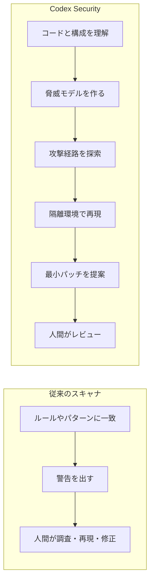

従来のツールは、警告を出したところで仕事が終わりがちでした。
Codex Securityは、**「本当に攻撃できるのか？」という証拠まで取りに行く**設計です。

## まず、コードではなく「システム」を見る

Codex Securityは、いきなり危険な関数を検索するのではなく、リポジトリ固有の脅威モデルを作ります。

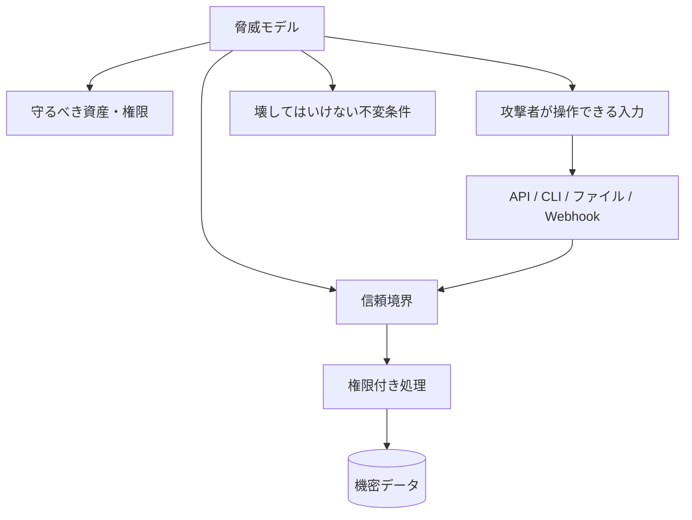

たとえば、同じ`eval()`でも、完全に内部だけで使われる処理と、外部入力が届く処理では危険度が違います。

Codex Securityは、単語ではなく次のような流れを見ます。

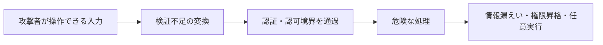

## 「怪しい」を「再現できた」に変える

見つけた候補は、そのまま脆弱性として報告されるわけではありません。
検証フェーズで、到達可能性や再現結果を確認します。

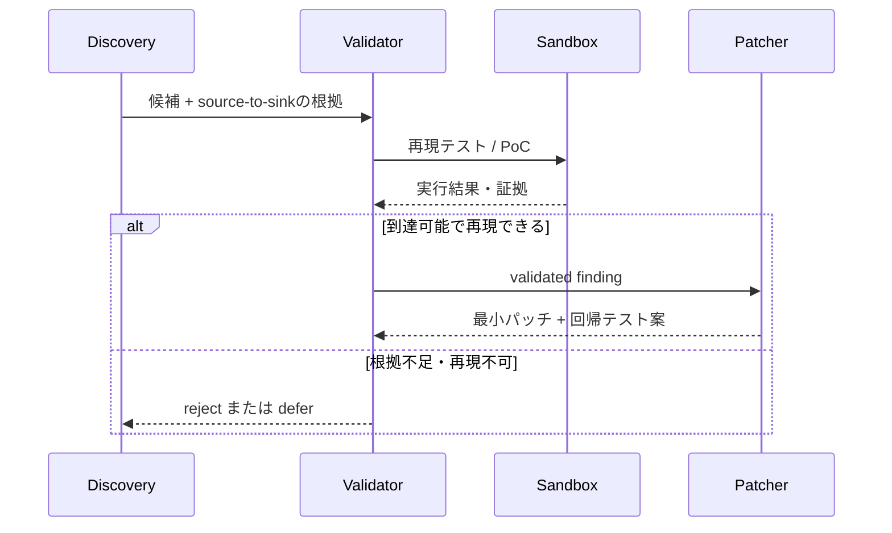

ここが重要です。

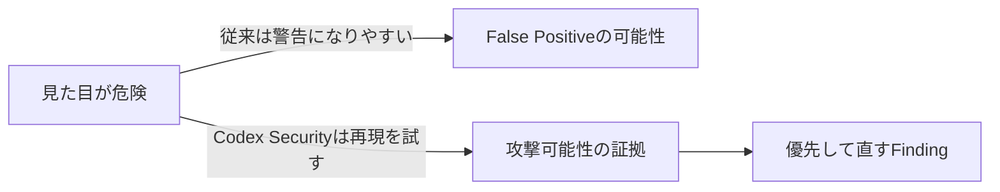

## Deep Scanは「1回のAI回答」を信用しない

リポジトリには、深い探索を行うためのマルチパス・マルチエージェント構成も含まれています。
独立した探索結果を統合し、重複を除去してから、中央で検証します。

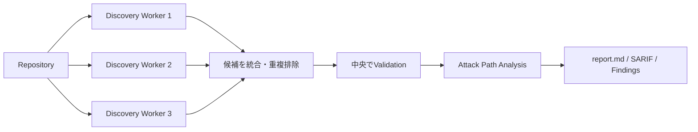

つまり、AIの探索にばらつきがあることを前提として、**複数回の独立探索で見落としを減らす**方向です。

## 何が大きなインパクトなのか

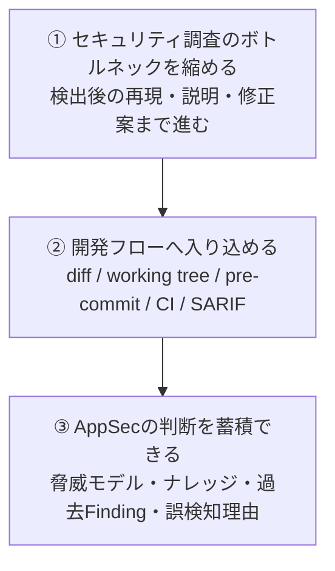

特に大きいのは、開発者が受け取るものが「警告一覧」から、次のセットへ変わることです。

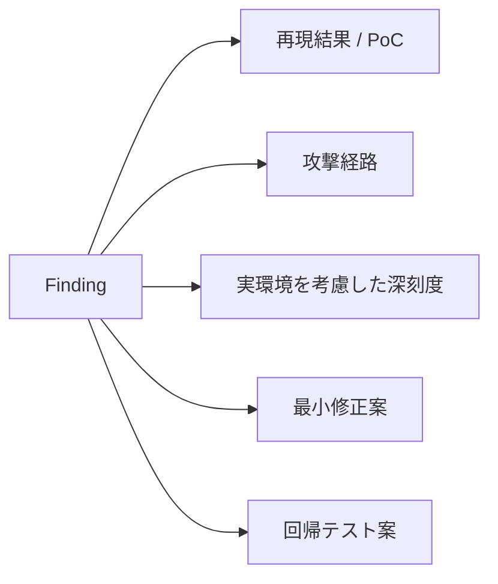

OpenAIのベータ運用に関する公表値では、直近30日間に外部リポジトリの**120万超のcommit**を走査し、**792件のCritical**と**10,561件のHigh**を特定したとされています。
また、OSSへの報告では14件のCVEが割り当てられたと説明されています。

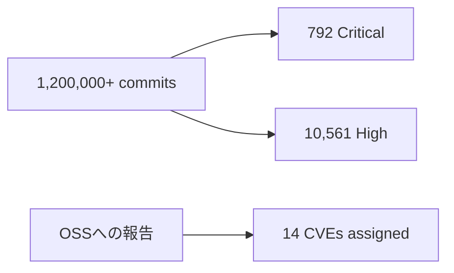

:::message
これらはOpenAIが公表したベータ運用の数値であり、独立した第三者ベンチマークではありません。製品性能の保証ではなく、規模感を示す参考値として見るのが安全です。
:::

## CLIはかなり実用寄り

最小構成はシンプルです。

```bash
npm install @openai/codex-security
npx @openai/codex-security login
npx @openai/codex-security scan .
```

差分だけをCIで確認することもできます。

```bash
SCAN_ROOT="$(mktemp -d)"

npx @openai/codex-security scan . \
  --diff origin/main \
  --output-dir "$SCAN_ROOT/results" \
  --json \
  --fail-on-severity high
```

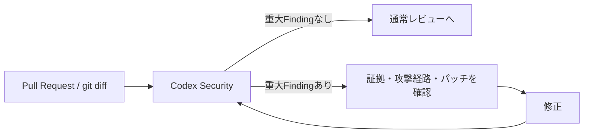

ほかにも、Working Treeの走査、pre-commit hook、複数リポジトリの一括走査、SARIF・CSV・JSON出力、過去スキャンとの比較、誤検知理由の記録などが用意されています。

## 「OSS化された」の意味には注意

リポジトリはApache-2.0で、CLI、TypeScript SDK、スキャン用プラグインやSkill定義を確認できます。
ただし、**完全にローカルだけで動く無料スキャナになったわけではありません**。

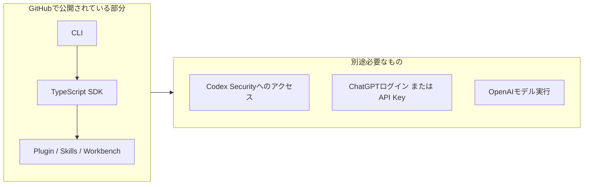

:::message
2026年7月時点のCLIは、Node.js 22.13以降の22系、24系または26系と、Python 3.10以降を必要とします。Codex Securityへのアクセスも必要です。1.0未満のため、公開APIが変更される可能性があります。
:::

## まだ「万能スキャナ」ではない

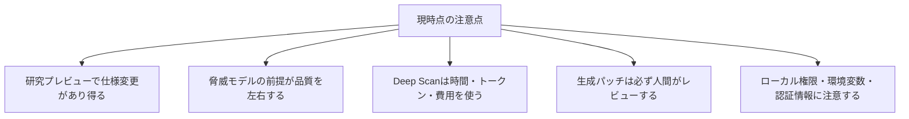

ローカルスキャンは、実行ユーザーのOS権限で動きます。
サブプロセスが環境変数を継承する可能性もあるため、不要なクラウド認証情報やトークンを外して実行するべきです。

結果にはソースコード断片、脆弱性の詳細、再現手順が含まれる可能性があります。
出力先はリポジトリ外に置き、閲覧権限を制限するのが安全です。

:::message alert
所有している、または明確に診断許可を得ているリポジトリだけを走査してください。生成されたパッチを自動で本番へ反映せず、通常のコードレビューとテストを通してください。
:::

そして、SAST・DAST・Dependency Scan・Fuzzingが不要になるわけでもありません。

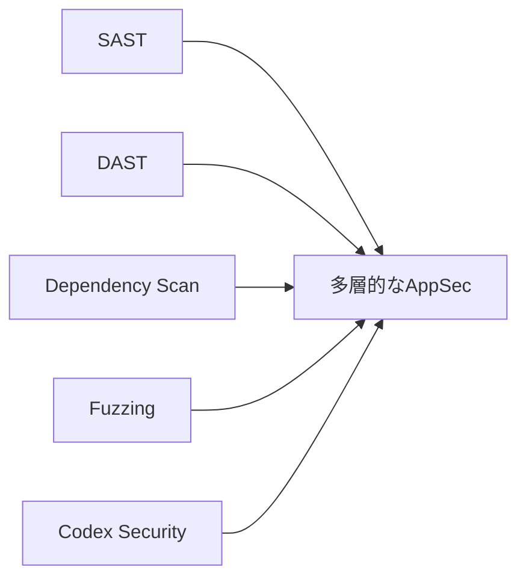

## まとめ：変わるのは「検出精度」より仕事の境界

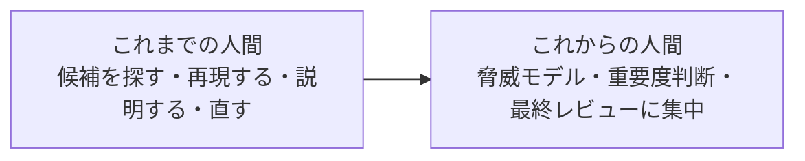

Codex Securityは、セキュリティ専門家を即座に置き換えるものではありません。

しかし、脆弱性診断ツールが**警告を投げるだけの存在**から、**証拠と修正案を持ってくる調査エージェント**へ変わる可能性を示しています。

「SASTキラー」と呼ぶにはまだ早いです。
ただし、AppSecのインターフェースが、静的なレポートから**反復するエージェント・ループ**へ移り始めた——そのインパクトはかなり大きいと思います。

## 参考資料

- [OpenAI: Codex Security: now in research preview](https://openai.com/index/codex-security-now-in-research-preview/)
- [GitHub: openai/codex-security](https://github.com/openai/codex-security)
- [OpenAI Help Center: Codex Security](https://help.openai.com/en/articles/20001107-codex-security)
- [Codex Security CLI quickstart](https://developers.openai.com/codex/security/cli)
