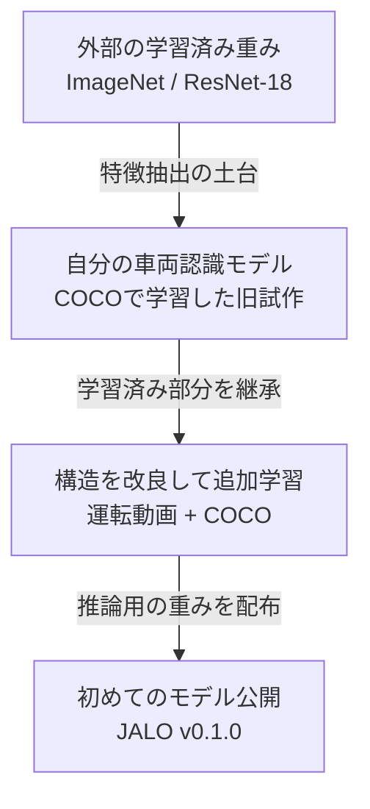
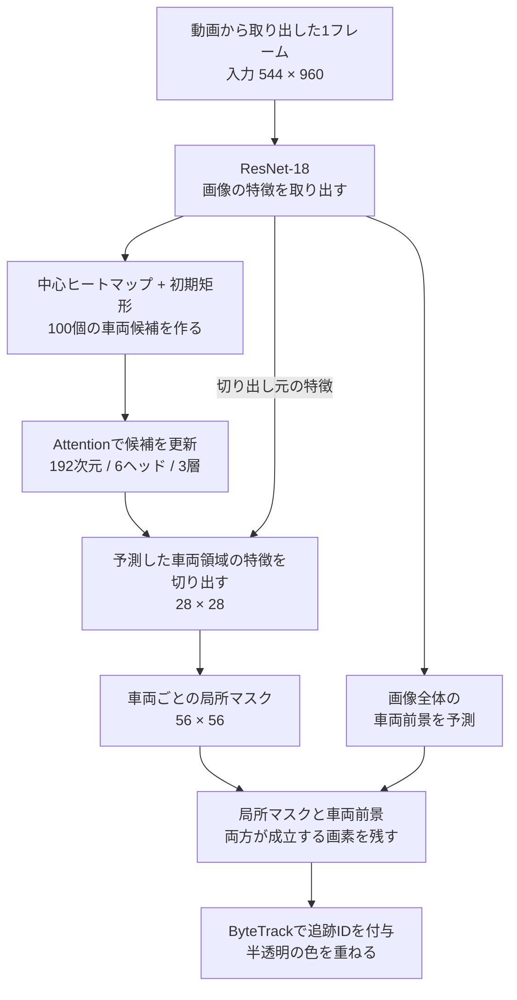
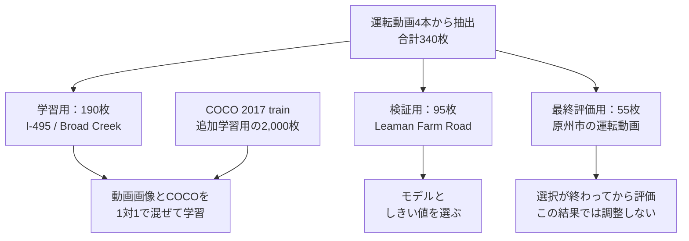
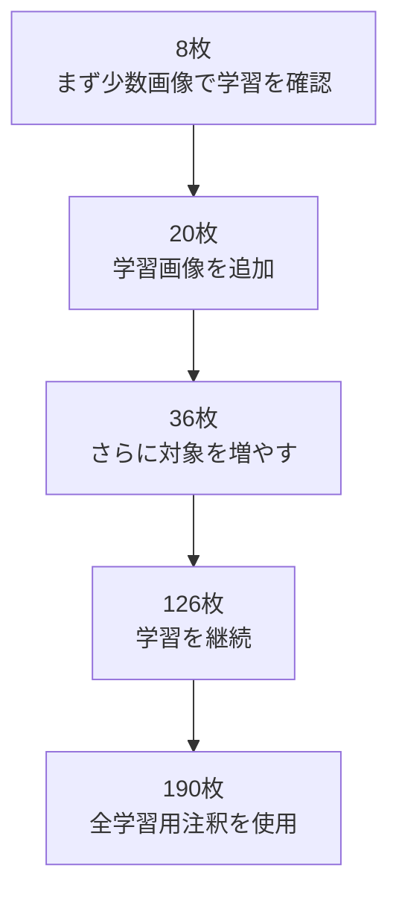
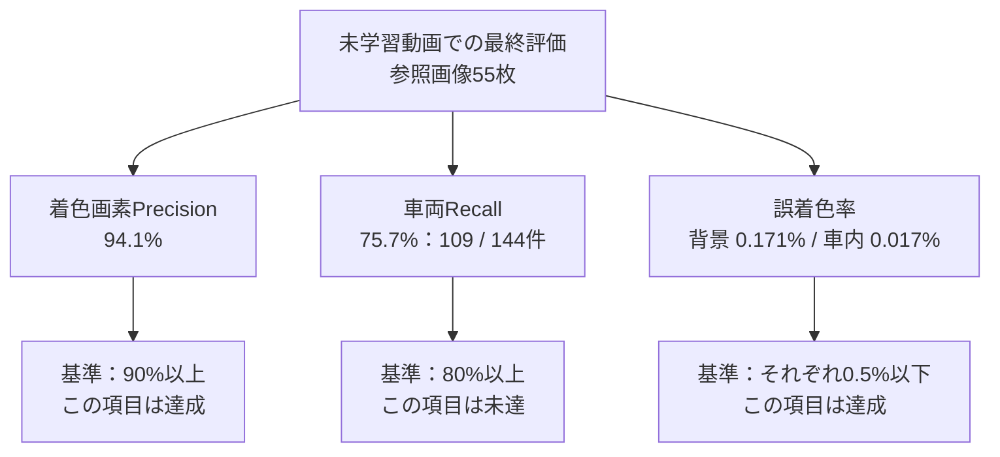
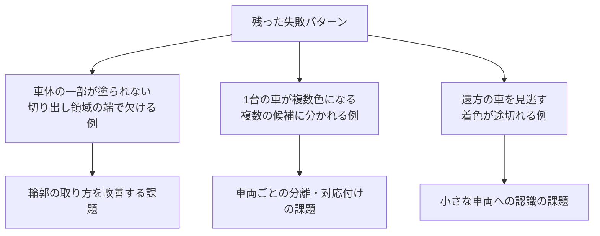
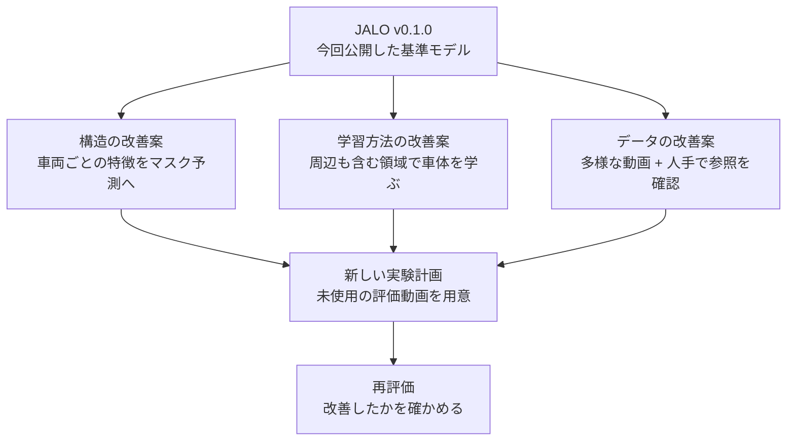

**初めて、自分で事前学習モデルを作りました。名前は「JALO」です。**

運転動画に映る車両を認識し、**車体の輪郭に沿って半透明の色を重ねるモデル**です。モデルの実装、学習、未学習動画での評価、重みの公開まで取り組みました。[^overview]

この記事は、高精度なモデルの完成報告ではありません。**初めて作ったモデルがどこまで動き、何がまだ難しかったのか**を、実際の出力と図で紹介する開発記録です。

https://github.com/james-yusuke/jalo

## 1. まずは、初めて作ったモデルの出力から


*図1：左上＝原映像、右上＝AI参照注釈、左下＝旧モデル、右下＝現在の配布モデル。比較画像はJALOリポジトリより。[^results]*

近距離の車両では、車体に沿った着色ができるようになりました。ただし、塗り残しや路面へのはみ出しも残っています。**「色が付いた」だけで成功とはしない**ことが、今回の評価の出発点です。[^results]

現在の配布版は **v0.1.0（研究版）**。画像中の `v0.1.1` は比較対象の旧番号で、現在は採番をやり直しています。[^overview]

## 2. 「初めて作った」のは、どの部分？

:::message
ここでいう「事前学習モデル」は、推論や次の追加学習の出発点として使える、車両認識用の学習済み重みです。**すべての重みをランダム初期化して学習したわけではありません。** 特徴抽出にはImageNet学習済みのResNet-18を使っています。[^model]
:::


*図2：外部の重みを使う部分と、自分で学習・改良した部分。[^model]*

既存の学習済み検出・セグメンテーションモデルを、そのまま動かしたものではありません。ResNet-18を土台に、車両の候補や輪郭を予測する構造を組み、学習しました。**初挑戦で取り組んだのは、この一連のモデルづくりです。**[^model]

## 3. 車を「枠で囲む」のではなく、「輪郭で塗る」

対象は **car・truck・bus** の3クラスです。車両ごとの領域を予測する「インスタンスセグメンテーション」を使い、見えている車体を塗ります。検出枠は表示せず、追跡IDごとに色をそろえます。[^overview]


*図3：推論の概略。矩形は内部の切り出しに使い、画面には描きません。[^model]*

「車両の候補を探す → 周囲の特徴を見る → その車両の輪郭を予測する」という流れです。参照注釈や正解の矩形を推論時に渡して、結果を補正する処理はありません。[^model]

## 4. 学習用と評価用は、動画ごと分けた

運転動画4本から、合計 **340枚** の参照画像を用意しました。学習用の動画は2本、検証と最終評価はそれぞれ別の1本です。[^data]


*図4：学習・検証・最終評価の役割。COCOの2,000枚は、追加学習で混ぜたデータです。[^data]*

**参照注釈はAIが作成し、AIが確認したものです。独立した人手検証は受けていません。** この評価は、特定の動画と参照注釈に基づく実験結果として扱います。[^results]

## 5. 少数の画像から、段階的に学習を進めた

注釈がそろうのに合わせて、学習用の動画画像を増やしました。最初は8枚で、少数の画像に十分適合できるかを確認しています。[^data]


*図5：追加学習に使う動画画像を増やした流れ。検証・最終評価画像は含みません。[^data]*

追加学習・評価は、破棄した試行も含めて **7時間4分・13,961更新**。全注釈を使う段階では、検証により **4,000更新時点** のモデルを選びました。これは初期のCOCO学習や注釈作成、実装、動画書き出しまで含めた総開発時間ではありません。[^results]

## 6. 改善した。でも、合格には届かなかった

最終評価で、着色画素Precisionは **94.1%**。一方、長辺32px以上の車両Recallは **75.7%** で、目標の80%に届きませんでした。以下は追跡を含む、実際の着色処理の値です。[^results]


*図6：最終評価の主要指標。総合判定には、検証・最終評価それぞれで、追跡前と描画後の条件を満たす必要があります。[^results]*

**「塗った場所は合っているか」と「塗るべき車を見逃していないか」は別の問題**です。検証側の車両Recallも63.2%にとどまりました。きれいに塗れた場面だけでなく、見逃しを含めて未達と判断しています。[^results]


*図7：90秒地点の比較。配置は図1と同じです。車体下端付近のはみ出しも、改善が必要な点です。[^results]*

:::details 評価条件をもう少し詳しく
車両Recallは、同じクラス同士でマスクIoUが0.5以上になるものを一対一で対応付けて計算しています。ignore領域を除いた最終評価対象は、長辺32px以上が144件、32px未満が19件です。同じ車両が別の時刻に登場する例も含むため、「144台の異なる車」という意味ではありません。

改善版のクラスしきい値は0.3、局所マスクと車両前景のしきい値はそれぞれ0.5、描画の透明度は45%です。何も塗らなければ背景への誤着色は減らせますが、そのような結果は合格にしません。

マスクAPなどの追跡前の指標と、着色後のPrecision・Recallは定義が異なります。詳細は[READMEの測定条件](https://github.com/james-yusuke/jalo/blob/3098a76c2048863b470e4a63bfb18578c123893e/README.md#参照注釈に基づく測定)にまとめています。
:::

## 7. 初挑戦で残ったのは、こんな課題


*図8：150秒地点の比較。配置は図1と同じです。遠方の小さな車両も評価対象として意識する必要があります。[^results]*


*図9：観察された失敗と、そこから整理した改善課題。個々の原因を実験で切り分けた結論ではありません。[^results][^model]*

処理速度にも課題があります。同じMac／MPSでの20秒動画3本の処理では、改善版は書き出し込みで **9.95fps**。元動画は24fpsなので、この測定では実時間処理に届いていません。入力解像度も旧モデルと異なるため、構造だけの速度比較ではありません。[^results]

## 8. 公開した重みで、自分の動画を試す

推論モデルは[Hugging Face](https://huggingface.co/james-yusuke/jalo)、結果動画や再開用の状態は[GitHub Release](https://github.com/james-yusuke/jalo/releases/tag/v0.1.0)で公開しています。推論だけなら、学習画像や参照注釈は不要です。[^usage]

:::details 環境構築とモデルの取得：macOS / Linux
Python 3.11以上と、`libx264`を含むFFmpegが必要です。`ffmpeg`と`ffprobe`の両方を実行できる状態にしてください。以下はREADMEに沿った実行例です。

```bash
# ソースと仮想環境を用意
git clone --branch v0.1.0 --depth 1 https://github.com/james-yusuke/jalo.git
cd jalo
python3 -m venv .venv
source .venv/bin/activate
python -m pip install .
python -m jalo doctor

# 公開モデルを取得
mkdir -p checkpoints
curl -fL \
   "https://huggingface.co/james-yusuke/jalo/resolve/main/jalo-local-vehicles-evaluated.pt?download=true" \
   -o checkpoints/jalo-local-vehicles-evaluated.pt
```

Windows PowerShellでは、仮想環境の有効化は `.venv\Scripts\Activate.ps1` です。その他の環境構築は[README](https://github.com/james-yusuke/jalo/blob/3098a76c2048863b470e4a63bfb18578c123893e/README.md#自分の動画で試す)を参照してください。
:::

入力動画を `demo.webm` として置き、まず20秒だけ書き出します。

```bash
python -m jalo demo \
  --input demo.webm \
  --checkpoint checkpoints/jalo-local-vehicles-evaluated.pt \
  --render masks --duration 20 \
  --output outputs/demo_masks.mp4 \
  --device auto --no-preview
```

出力は `outputs/demo_masks.mp4`。`--device auto` はCUDA → MPS → CPUの順に選びますが、実機で確認済みなのはMac／MPSです。CUDA実機は未検証です。現行版は短い診断動画向けの研究版であり、運転中の安全判断に使うものではありません。[^usage]

## 9. 初めてのモデル公開は、次の実験の出発点

次の候補は、車両ごとの特徴をマスク予測へ渡す変更、周辺を含む領域での学習、データの多様化と独立した人手による参照確認です。**いずれも未実装・未検証の案**として、現状の結果とは分けています。[^model]


*図10：次の実験の候補。実施済みの成果や、改善の保証を示す図ではありません。[^model]*

**初めて事前学習モデルを作って公開できたことと、実用的な品質に到達したことは別です。** 今回は前者まで。輪郭を塗れるようになった成果と、見逃し・塗り残しという課題を、両方残すことができました。

このJALOを出発点に、次は「動いた」から「より安定して認識できる」へ進めていきたいです。

---

### 比較画像の出典

図1・7・8はJALOリポジトリで公開している比較画像を改変せず参照しています。元映像はChoi Kwang-moによる[原州市の運転動画](https://commons.wikimedia.org/wiki/File:2020-04-16_원주시_도로주행.webm)（[CC0 1.0](https://creativecommons.org/publicdomain/zero/1.0/)）です。JALO側でフレーム抽出・注釈や予測の重畳・比較配置が行われた画像は、[CC BY-SA 4.0](https://creativecommons.org/licenses/by-sa/4.0/)として提供されています。ソースコードのMIT Licenseとは区別してください。[^license]

[^overview]: [JALO README：プロジェクト概要・v0.1.0の位置付け](https://github.com/james-yusuke/jalo/blob/3098a76c2048863b470e4a63bfb18578c123893e/README.md)。本記事は2026年9月16日時点の公開情報を基にしています。
[^results]: [JALO README：未学習の運転動画での結果・測定条件](https://github.com/james-yusuke/jalo/blob/3098a76c2048863b470e4a63bfb18578c123893e/README.md#未学習の運転動画での結果)。数値はリポジトリの実験記録であり、この記事のために新しく測定した値ではありません。
[^model]: [JALO README：モデルと再現](https://github.com/james-yusuke/jalo/blob/3098a76c2048863b470e4a63bfb18578c123893e/README.md#モデルと再現)、[VehicleROIの実装](https://github.com/james-yusuke/jalo/blob/3098a76c2048863b470e4a63bfb18578c123893e/jalo/roi_model.py)。図は処理の理解のために簡略化しています。
[^data]: [JALO README：使用した無料の運転動画と学習データ](https://github.com/james-yusuke/jalo/blob/3098a76c2048863b470e4a63bfb18578c123893e/README.md#使用した無料の運転動画と学習データ)。
[^usage]: [JALO README：自分の動画で試す](https://github.com/james-yusuke/jalo/blob/3098a76c2048863b470e4a63bfb18578c123893e/README.md#自分の動画で試す)、[v0.1.0 Release](https://github.com/james-yusuke/jalo/releases/tag/v0.1.0)。
[^license]: [JALO README：ライセンス](https://github.com/james-yusuke/jalo/blob/3098a76c2048863b470e4a63bfb18578c123893e/README.md#ライセンス)。
