> **長文を読むAIは、過去を全部保存するべきか。要点だけを持ち歩くべきか。**  
> TransformerとMambaの違いは、突き詰めるとこの問いに行き着く。

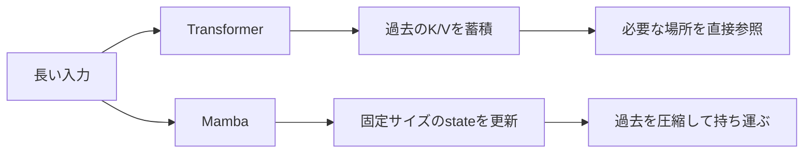

Transformerは、必要になったら過去を**見返す**。  
Mambaは、読み進めながら内部状態を**書き換える**。

本記事では、Mamba-1からMamba-3までを、画像ファイルを使わずにMermaid・表・コードで追いかける。数式は最小限だが、設計思想の違いは省略しない。

:::message
調査基準日は2026年7月16日。Mamba-3の実装・導入方法は更新される可能性があるため、実行時は公式READMEも確認してほしい。
:::

## この記事の地図

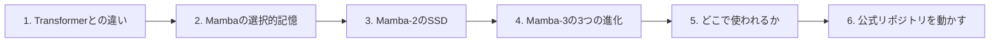

## 30秒で全体像

| 世代・方式 | ひと言で表すと | 主役となる発想 | 得意な方向 |
|---|---|---|---|
| Transformer | 過去を直接見返す | Self-Attention | 任意位置の参照、検索、成熟した基盤 |
| Mamba-1 | 選んで覚える | Selective SSM | 長系列、ストリーミング、固定state |
| Mamba-2 | 再帰を行列積として学習する | SSD | GPU学習、テンソル並列、スループット |
| Mamba-3 | 推論時の状態追跡を磨く | 新しい離散化・複素state・MIMO | 推論効率、retrieval、state tracking |
| Hybrid | 倉庫と作業メモを併用する | Attention + Mamba | 品質と効率の現実的な折衷 |

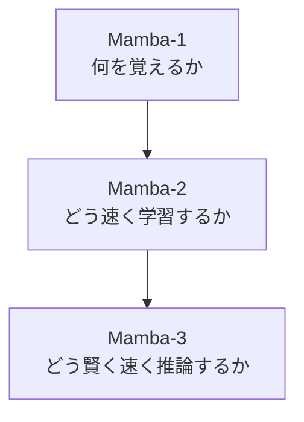

## 1. Transformerとの違い

### Transformerは「全員で過去を見返す」

Self-Attentionでは、各トークンが他のトークンとの関係を計算する。

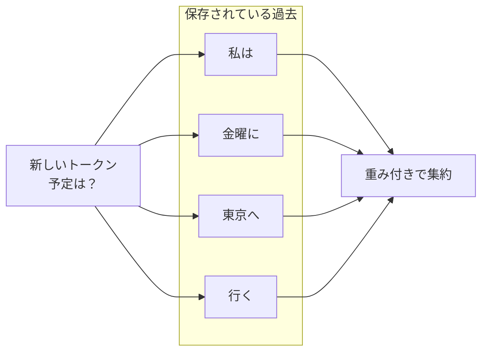

新しいトークンは、保存されたKey/Valueを使って過去を参照する。これは**「金曜」という文字列を直接探す**ような処理に強い。

### Mambaは「一つの状態を更新し続ける」


Mambaはトークンを読むたびにstateを更新する。生成時に引き継ぐのは、原則として過去トークンそのものではなく、このstateだ。

```text
Transformer : [token][token][token][token][token] ... を参照
Mamba       :                         [ state ] を更新
```

### 数式で見ると、違いはさらに短い

TransformerのAttentionは、クエリと過去のキーを比較する。

$$
\mathrm{Attention}(Q,K,V)=\mathrm{softmax}\left(\frac{QK^\top}{\sqrt{d}}\right)V
$$

Mambaの土台となるSSMは、前の状態と現在の入力から次の状態を作る。

$$
h_t = \bar{A}_t h_{t-1} + \bar{B}_t x_t, \qquad y_t = C_t h_t
$$

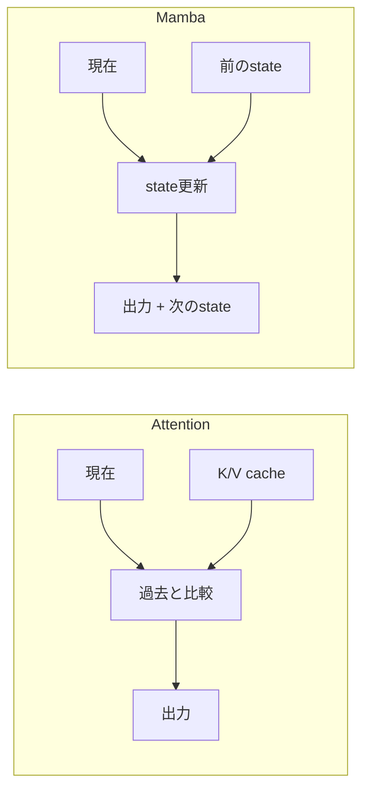

### 計算量とメモリ

系列長を $L$ とした概念比較は次の通り。

| 観点 | 標準的なDense Transformer | Mamba系 |
|---|---:|---:|
| 学習・prefillの系列方向計算 | $O(L^2)$ | $O(L)$ |
| 生成時に保持する過去情報 | KV cache: $O(L)$ | state: $O(1)$ |
| 新規1トークンの過去参照 | 文脈長とともに増える | 文脈長に対して一定 |
| 過去の表現 | トークン単位で比較的明示的 | 有限stateへ圧縮 |
| 任意位置への直接アクセス | 得意 | 原理的に圧縮の影響を受ける |

:::message alert
`O(1)`は**文脈長に対して**一定という意味。stateの実サイズは、層数・チャネル数・state sizeなどには依存する。またFlashAttentionはメモリ効率を大きく改善するが、標準的なDense Attentionの全ペア計算そのものは残る。
:::

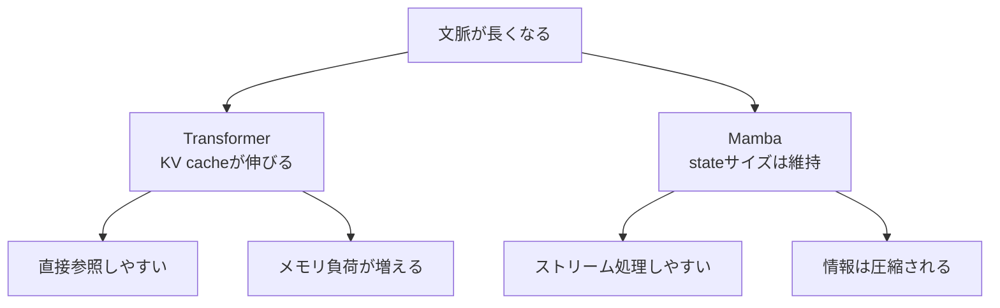

つまり、Mambaは「無料で長文が得意」なのではない。  
**直接参照を捨て、圧縮された記憶と引き換えに線形性を得ている。**

## 2. Mamba-1：選んで覚える

従来の線形SSMは、入力が変わっても似た更新則を使うため、言語のような情報密度の高いデータで苦戦しやすかった。Mamba-1は $\Delta_t, B_t, C_t$ を入力から作り、離散化後の更新を内容に応じて変化させた。[^mamba]

### 同じ一文でも、重要度は同じではない

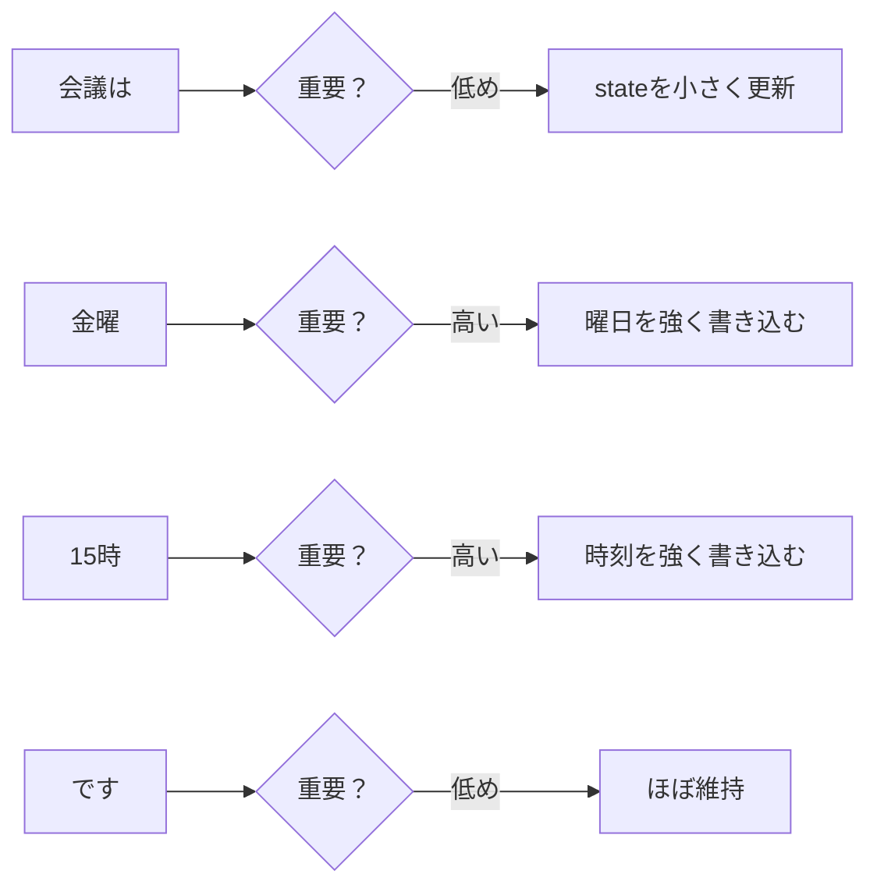

選択性を直感的に言えば、次の3操作を入力ごとに調整する仕組みだ。

| 操作 | イメージ | 関連する量 |
|---|---|---|
| どれだけ過去を残すか | 忘却の速さを変える | $\Delta$ と状態遷移 |
| 何をstateへ書くか | 入力の重要部分を選ぶ | $B$ |
| stateの何を読むか | 出力へ取り出す情報を選ぶ | $C$ |

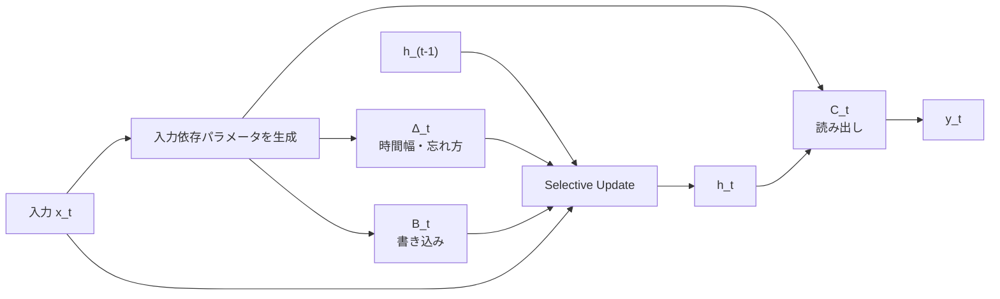

### Mambaブロックの見取り図

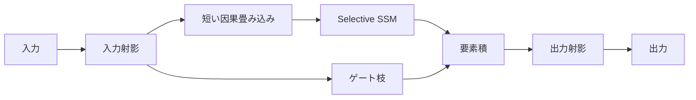

Mambaは単に古いRNNを復活させたものではない。**入力依存の選択性**と、GPUで動かすための**hardware-aware selective scan**をセットで持ち込んだ点が重要だ。

### 線形でも、素朴な再帰は速くない

GPUは、大きな行列積をまとめて処理するのが得意。一方で、1トークンずつHBMへstateを書き戻す素朴な再帰は、メモリ転送待ちになりやすい。

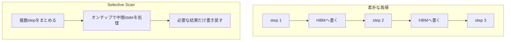

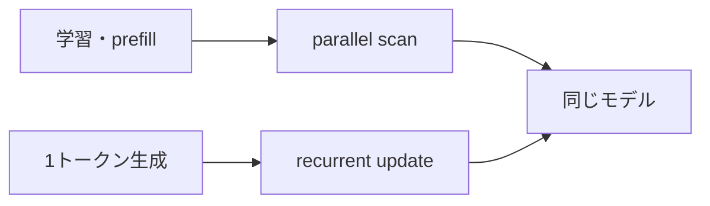

理論上の $O(L)$ だけでは不十分で、**GPUのメモリ階層に合わせて計算を融合すること**が、Mambaの実速度を支えている。

## 3. Mamba-2：再帰と行列積は、実は同じ景色だった

Mamba-2の中心は、**Structured State Space Duality（SSD）**。[^mamba2]

### 生成時は再帰、学習時は行列積

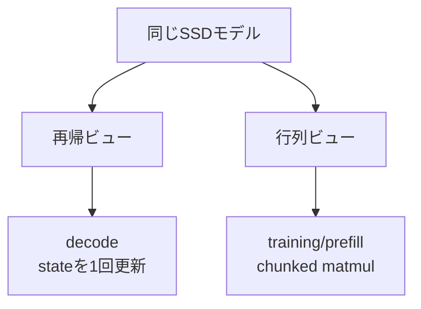

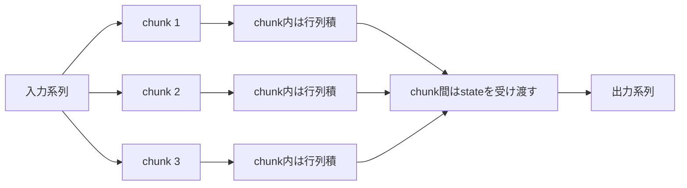

この二重の見方により、生成時の再帰性を保ちながら、学習時はGPUが得意な行列積へ寄せられる。

### Mamba-1とMamba-2の違い

| 観点 | Mamba-1 | Mamba-2 |
|---|---|---|
| 核心 | Selective SSM | SSD |
| 状態遷移の構造 | 対角構造 | ヘッド内でスカラー×単位行列に制約 |
| 主な狙い | 言語で選択的に記憶 | 学習をmatmul中心へ寄せる |
| 学習アルゴリズム | Selective scan | SSDのchunked algorithm |
| state size | 比較的小さめが中心 | 大きなstateを扱いやすい |
| 並列化 | 独自scanが中心 | head分割・tensor parallelと相性がよい |
| 論文での報告 | 長系列で高スループット | コア層がMamba-1より2〜8倍高速 |


制約を増やすことは、必ずしも弱体化ではない。Mamba-2では構造を単純化したからこそ、Attentionに近い行列的な見方が可能になった。

## 4. Mamba-3：学習ファーストから推論ファーストへ

Mamba-2が大きく改善したのは学習効率だった。しかし線形モデルには、まだ2つの不満が残った。

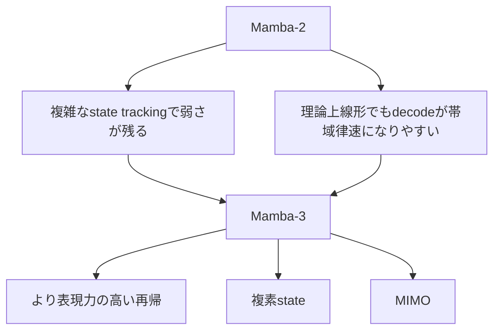

Mamba-3は2026年3月に公開され、**推論を設計の中心**に据えた。論文が掲げる3本柱は、より表現力の高いSSM離散化、複素数値の状態更新、MIMOである。[^mamba3]

### 改善1：区間の片側だけでなく、両端を見る

従来の更新は、時間区間の入力を単純な形で近似する。Mamba-3は**exponential-trapezoidal discretization**を導入し、区間の始点と終点の情報を使う、より表現力の高い再帰を作る。

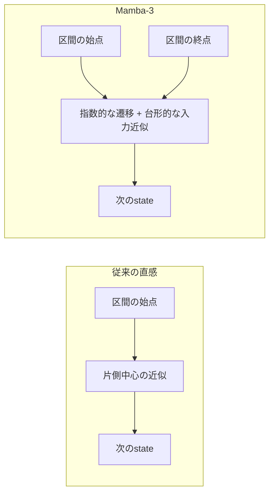

```text
従来の感覚 :  今この瞬間の入力で更新する
Mamba-3    :  区間の入口と出口を見て、より豊かに更新する
```

この更新は、実験上、従来ブロック外に置かれていた短い因果畳み込みの役割の一部を再帰へ取り込める。つまり「部品を増やして強くする」のではなく、**更新式そのものを強くする**方向だ。

### 改善2：実数stateから複素stateへ

実数の状態遷移は、直感的には「残す・減衰する」が中心。複素stateなら、そこに**回転**を加えられる。

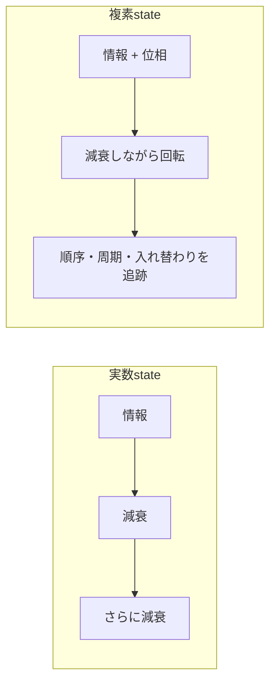

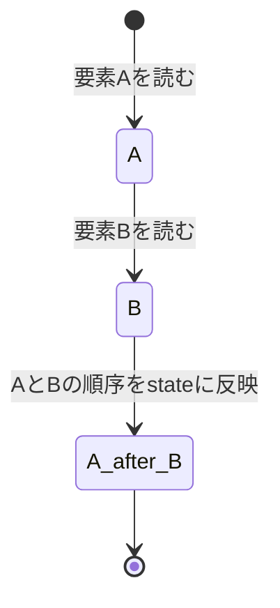

回転を持つことで、単純な強弱だけでなく、順序や位相を表現しやすくなる。論文ではdata-dependent RoPEとしても解釈され、state-tracking能力の改善につながる。

### 改善3：SISOからMIMOへ

SISOは、1入力・1出力の小さな更新を大量に行う。小さすぎる演算は、GPUの計算器よりメモリ帯域がボトルネックになりやすい。

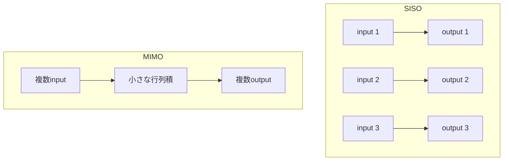

```text
SISO : 小さな演算を何度も実行  → 帯域待ちが目立つ
MIMO : 複数をまとめて行列化    → 演算密度を上げる
```

Mamba-3論文では、MIMO版がSISO版より品質を改善しながら、decode latencyを増やさない設計として提示された。狙いは単なる並列化ではなく、**待ち時間を有用な計算へ置き換えること**にある。

### Mamba-2とMamba-3の違い

| 観点 | Mamba-2 | Mamba-3 |
|---|---|---|
| 設計の中心 | 学習効率 | 推論効率と能力の両立 |
| 数理の土台 | SSD | SSM原理を使った、より表現力の高い再帰 |
| 状態 | 主に実数 | 複素stateを導入 |
| 入出力 | 主にSISO | SISOに加えてMIMO |
| 得意にしたい課題 | 高速学習・大きなstate | retrieval・state tracking・decode効率 |
| 外付け短畳み込み | Mambaブロックの一部 | 更新式へ役割を取り込める構成を検討 |
| 一言で | 再帰をGPU学習へ適応 | 推論時の記憶と演算密度を再設計 |

```mermaid
flowchart LR
    M2["Mamba-2"] --> T["training-first<br/>matmulへ寄せる"]
    M3["Mamba-3"] --> I["inference-first<br/>state追跡とdecodeを改善"]
```

論文の1.5B条件では、Mamba-3は強い線形モデルの比較対象に対して平均下流精度を0.6ポイント改善し、MIMO版がさらに1.2ポイントを上積みした。またMamba-2の半分のstate sizeで同程度のperplexityを得たと報告されている。[^mamba3]

:::message
これらは論文内の特定モデル・ハードウェア・評価条件における結果。自分の用途では、品質・prefill・decode・メモリを同一条件で測る必要がある。
:::

## 5. Transformer、Mamba、Hybrid——結局どれを選ぶ？

### 強みは対立ではなく、補完関係にある

```mermaid
flowchart LR
    subgraph Transformer["Transformerの強み"]
        A1["任意位置を直接参照"]
        A2["RAG・検索・ツール利用"]
        A3["成熟した最適化基盤"]
    end
    subgraph Mamba["Mambaの強み"]
        M1["線形な系列処理"]
        M2["固定サイズstate"]
        M3["ストリーミング"]
    end
    Transformer --> H["Hybrid"]
    Mamba --> H
    H --> B["要所だけAttention<br/>大部分をMamba"]
```

| 要件 | Transformer | Mamba | Hybrid |
|---|:---:|:---:|:---:|
| 長文の任意箇所を厳密に参照 | ◎ | △ | ◎ |
| decode時の文脈長依存メモリを抑える | △ | ◎ | ○ |
| ストリームを一定メモリで処理 | △ | ◎ | ○ |
| 既存LLMエコシステムを最大活用 | ◎ | △ | ○ |
| 長文品質と効率を両立 | ○ | ○ | ◎ |
| 実装の単純さ・成熟度 | ◎ | △ | △ |

「MambaはTransformerキラーか」という問いより、**どの層に直接参照が必要で、どの層は圧縮stateで十分か**を考える方が実用的だ。

### 採用判断フロー

```mermaid
flowchart TD
    S["新しい系列モデルを選ぶ"] --> Q1{"入力や会話履歴が長い？"}
    Q1 -->|"いいえ"| T["まずTransformer"]
    Q1 -->|"はい"| Q2{"KV cacheがコストの主因？"}
    Q2 -->|"いいえ"| T
    Q2 -->|"はい"| Q3{"任意位置の厳密な検索が最重要？"}
    Q3 -->|"はい"| H["Hybridを優先"]
    Q3 -->|"いいえ"| Q4{"ストリーム・一定メモリが重要？"}
    Q4 -->|"はい"| M["Mamba系を評価"]
    Q4 -->|"いいえ"| H
```

### 比較実験で最低限測るもの

```mermaid
flowchart LR
    TEST["同じモデル規模・同じデータで比較"] --> Q["品質"]
    TEST --> S["速度"]
    TEST --> M["メモリ"]
    Q --> Q1["通常タスク"]
    Q --> Q2["長距離retrieval"]
    Q --> Q3["state tracking"]
    S --> S1["prefill latency"]
    S --> S2["decode latency"]
    S --> S3["throughput"]
    M --> M1["activation"]
    M --> M2["KV/state"]
    M --> M3["最大batch"]
```

## 6. どこで使われている？

Mambaは、純粋な言語モデルだけでなく、ハイブリッドLLM、画像、DNA、医用画像などへ広がっている。ここでの「使われている」は、商用提供、公開モデル、研究実装を含む。

```mermaid
flowchart TD
    M["Mamba / Selective SSM"] --> L["言語・コード"]
    M --> E["企業LLM・エージェント"]
    M --> V["画像・映像"]
    M --> G["ゲノム"]
    M --> MED["医用画像"]
    L --> C1["Codestral Mamba"]
    L --> C2["Falcon Mamba"]
    L --> C3["Jamba"]
    E --> E1["NVIDIA Nemotron 3"]
    E --> E2["IBM Granite 4.0"]
    V --> V1["Vim / VMamba"]
    G --> G1["Caduceus"]
    MED --> M1["U-Mamba"]
```

### 公開モデル・製品寄りの例

| 例 | 構成 | 使いどころ・狙い |
|---|---|---|
| Codestral Mamba | Mamba-2ベースのコードモデル | コード生成、長いコード文脈の研究・ローカル利用 |
| Jamba / Jamba 1.5 | Transformer + Mamba + MoE | 長文ドキュメント、企業向け生成AI |
| Falcon Mamba 7B[^falcon] | Attention-free Mamba系 | 純Mamba型言語モデルの公開例 |
| NVIDIA Nemotron 3 | Mamba-Transformer系ハイブリッド + MoE | 長時間動くエージェント、大規模コンテキスト |
| IBM Granite 4.0 | Mamba-2/Transformerハイブリッド | 企業向け、低メモリ、複数セッション、エージェント |

Codestral Mambaは、Mistral AIが公開したMamba-2ベースのコードモデル。JambaはAttentionを完全に捨てず、TransformerとMambaを交互に使う。Nemotron 3やGranite 4.0も、実用モデルでは**純MambaよりHybridが有力**であることを示している。[^codestral][^jamba][^nemotron3][^granite4]

### 研究分野での例

| 分野 | 代表例 | Mambaが合う理由 |
|---|---|---|
| 画像分類・検出・セグメンテーション | Vim[^vim]、VMamba[^vmamba] | 画像を長いパッチ列として扱い、全Attentionを避ける |
| DNA・ゲノム | Caduceus[^caduceus] | 塩基配列が非常に長く、双方向の文脈が重要 |
| 医用画像 | U-Mamba[^umamba] | CNNの局所性とSSMの長距離依存を組み合わせる |
| 音声・時系列 | Mamba系研究[^mamba] | 連続的に到着する長い系列と相性がよい |

```mermaid
flowchart LR
    DATA["Mambaが刺さりやすいデータ"] --> A["長い"]
    DATA --> B["連続的に到着する"]
    DATA --> C["全部の組合せ比較が重い"]
    DATA --> D["有限stateへ圧縮しても価値が残る"]
```

共通点は明快だ。**全要素どうしを毎回比較すると高価だが、左から右、あるいは決めた走査順で状態を伝えられるデータ**でMambaは魅力を持つ。

## 7. 公式リポジトリを動かす

公式リポジトリは `state-spaces/mamba`。Mamba-1、Mamba-2、Mamba-3のブロック実装が同じリポジトリにある。[^repo]

```mermaid
flowchart LR
    R["state-spaces/mamba"] --> I["インストール"]
    I --> B1["Mamba"]
    I --> B2["Mamba2"]
    I --> B3["Mamba3"]
    B1 --> X["Tensor B×L×D"]
    B2 --> X
    B3 --> X
    X --> Y["同形状の出力"]
```

### インストール

PyPIのコアパッケージを使う場合は次の形。

```bash
pip install mamba-ssm --no-build-isolation
```

2026年7月16日時点で、Mamba-3を最新ソースから使う場合はGitHubから入れる案内になっている。

```bash
pip install git+https://github.com/state-spaces/mamba.git --no-build-isolation
```

CUDAの`selective_scan_cuda`拡張も入れる場合は、公式READMEのopt-inフラグを付ける。

```bash
MAMBA_KEEP_CUDA_BUILD=TRUE \
pip install git+https://github.com/state-spaces/mamba.git \
  --no-build-isolation
```

```mermaid
flowchart TD
    START["何を試す？"] --> Q{"Mamba-3が必要？"}
    Q -->|"いいえ"| PYPI["PyPI: mamba-ssm"]
    Q -->|"はい"| SRC["GitHub最新ソース"]
    SRC --> CUDA{"CUDA selective scanも必要？"}
    CUDA -->|"いいえ"| CORE["通常のsource install"]
    CUDA -->|"はい"| FLAG["MAMBA_KEEP_CUDA_BUILD=TRUE"]
```

### Mamba-3の最小例

公式READMEに沿ったブロック単体の例。

```python
import torch
from mamba_ssm import Mamba3

batch, length, dim = 2, 2048, 768
x = torch.randn(
    batch,
    length,
    dim,
    device="cuda",
    dtype=torch.bfloat16,
)

model = Mamba3(
    d_model=dim,
    d_state=128,
    headdim=64,
    is_mimo=True,
    mimo_rank=4,
    chunk_size=16,
    is_outproj_norm=False,
    dtype=torch.bfloat16,
).cuda()

y = model(x)
assert y.shape == x.shape
```

:::message
これは言語モデル全体ではなく、Mamba-3ブロックの動作確認。トークナイザー、埋め込み、複数層、LM Head、学習ループは別途必要になる。
:::

### リポジトリを読む順番

```mermaid
flowchart TD
    README["README.md"] --> MOD["mamba_ssm/modules/"]
    MOD --> M1["mamba_simple.py"]
    MOD --> M2["mamba2.py / mamba2_simple.py"]
    MOD --> M3["mamba3.py"]
    M2 --> SSD["ssd_minimal.py"]
    M1 --> OPS["ops/selective_scan_interface.py"]
    M3 --> TEST["tests / benchmarks"]
```

- まずREADMEで依存関係とAPIを確認する。
- Mamba-2の数理と実装の橋渡しには`ssd_minimal.py`が読みやすい。
- Mamba-3は`mamba3.py`とテストを並べて読むと、`is_mimo`や`chunk_size`の制約を追いやすい。

## おわりに：Mambaが変えたのは、速さより「記憶の形」

```mermaid
flowchart LR
    T["Transformer"] --> TW["過去を並べる"]
    TW --> TL["必要な場所を見返す"]
    M["Mamba"] --> MW["過去をstateへ圧縮"]
    MW --> ML["stateを書き換えながら進む"]
    TL --> H["次世代は両方を組み合わせる"]
    ML --> H
```

Mamba-1は**選ぶ力**を作った。  
Mamba-2は**GPUで学習する力**を磨いた。  
Mamba-3は**状態を追跡しながら推論する力**を強くした。

Attentionが消えるかどうかだけを見ると、この流れを見誤る。面白いのは、次のモデルが**「直接見返せる倉庫」と「持ち運べる作業メモ」を、どの割合で持つのか**だ。

---

## 参考資料

[^repo]: [state-spaces/mamba — Official GitHub repository](https://github.com/state-spaces/mamba)
[^mamba]: [Mamba: Linear-Time Sequence Modeling with Selective State Spaces](https://arxiv.org/abs/2312.00752)
[^mamba2]: [Transformers are SSMs: Generalized Models and Efficient Algorithms Through Structured State Space Duality](https://arxiv.org/abs/2405.21060)
[^mamba3]: [Mamba-3: Improved Sequence Modeling using State Space Principles](https://arxiv.org/abs/2603.15569)
[^codestral]: [Codestral Mamba 7B model card — Mistral AI](https://docs.mistral.ai/models/model-cards/codestral-mamba-7b-0-1)
[^jamba]: [Jamba: A Hybrid Transformer-Mamba Language Model — AI21](https://www.ai21.com/research/jamba-a-hybrid-transformer-mamba-language-model/)
[^nemotron3]: [Inside NVIDIA Nemotron 3 — NVIDIA Technical Blog](https://developer.nvidia.com/ja-jp/blog/inside-nvidia-nemotron-3-techniques-tools-and-data-that-make-it-efficient-and-accurate/)
[^granite4]: [IBM Granite 4.0 — Hybrid Mamba/Transformer models](https://www.ibm.com/jp-ja/new/announcements/ibm-granite-4-0-hyper-efficient-high-performance-hybrid-models)
[^falcon]: [Falcon Mamba 7B model card](https://huggingface.co/tiiuae/falcon-mamba-7b)
[^vim]: [Vision Mamba: Efficient Visual Representation Learning with Bidirectional State Space Model](https://arxiv.org/abs/2401.09417)
[^vmamba]: [VMamba: Visual State Space Model](https://arxiv.org/abs/2401.10166)
[^caduceus]: [Caduceus: Bi-Directional Equivariant Long-Range DNA Sequence Modeling](https://arxiv.org/abs/2403.03234)
[^umamba]: [U-Mamba: Enhancing Long-range Dependency for Biomedical Image Segmentation](https://arxiv.org/abs/2401.04722)
