:::message alert
この記事は2026-06-29時点の公開情報だけで検証しています。結論はシンプルです。OpenMythosは「公式再現」ではありません。公開論文を組み合わせた「仮説実装」として読むのが精確です。
:::

## 0. まず結論

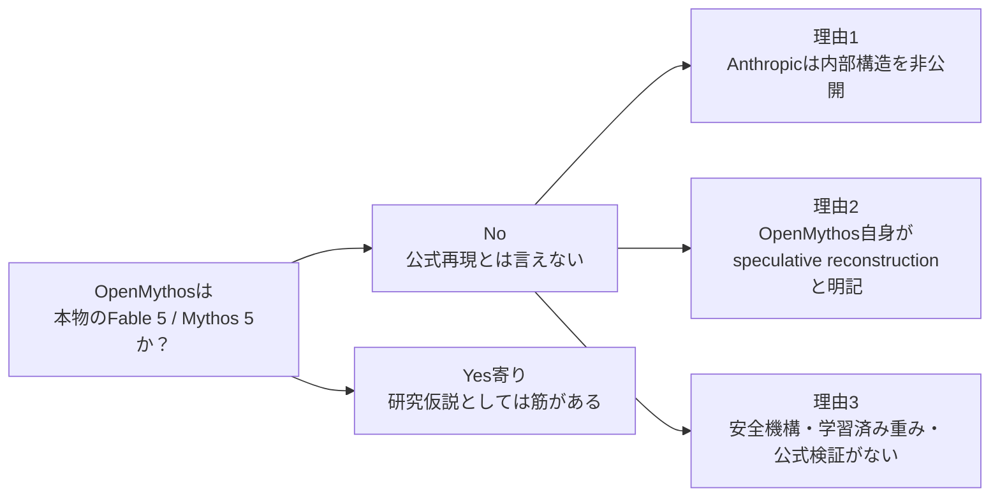

**判定:** 公式モデルの正しい再現ではない。RDT・MoE・MLAなどを使った、教育的で面白い「推測アーキテクチャ」です。

---

## 1. 今回の情報源

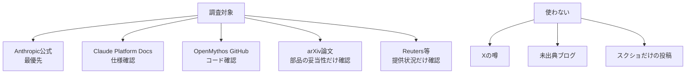

ZennはMermaidを公式に表示できます。この記事の図は、すべてZenn上でそのままレンダリングされるMarkdown図です[^zenn-mermaid]。

---

## 2. Fable 5 / Mythos 5で公式に言えること

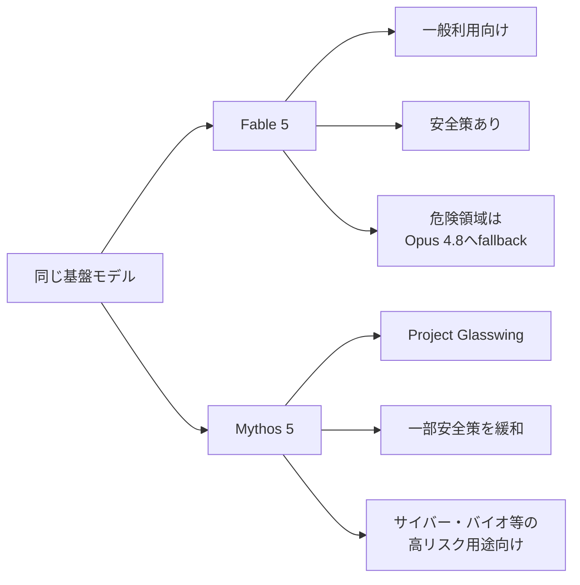

公式発表では、Fable 5とMythos 5は「同じ基盤モデル」の別構成です[^anthropic-launch]。Fable 5は広く使うために安全策を強め、Mythos 5は信頼されたパートナー向けに一部制約を緩めた位置づけです[^anthropic-mythos]。

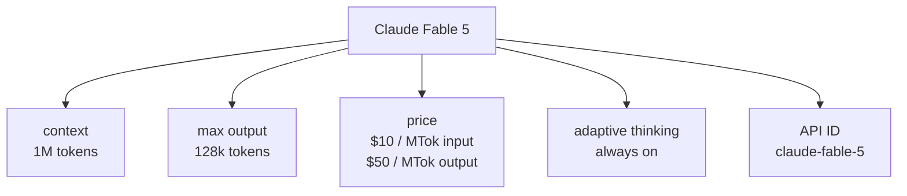

Docs上の仕様は、1Mコンテキスト、最大128k出力、入力$10/MTok・出力$50/MTokです[^claude-models][^claude-pricing]。

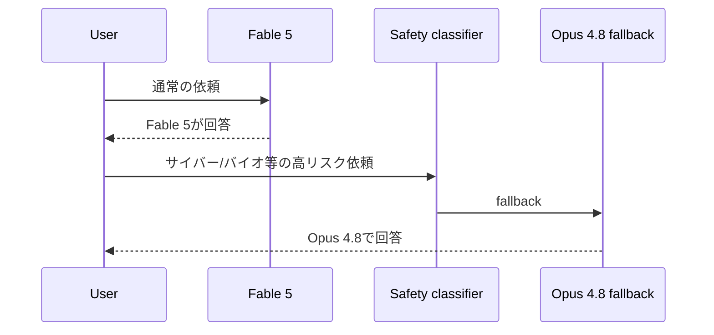

Fable 5向けプロンプト文書では、危険領域の分類器とfallbackが説明されています[^fable-prompting]。この安全機構はOpenMythosの主対象ではありません。

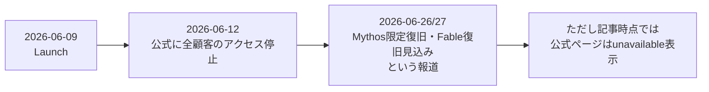

2026-06-12にAnthropicは、米国政府指令によりFable 5 / Mythos 5を全顧客向けに停止すると発表しました[^anthropic-suspend]。2026-06-27には、Fable 5復旧が近いというReuters報道がありますが、公式ページ上はこの記事時点でunavailable表示です[^reuters-restore][^anthropic-fable]。

---

## 3. OpenMythosが主張している構造

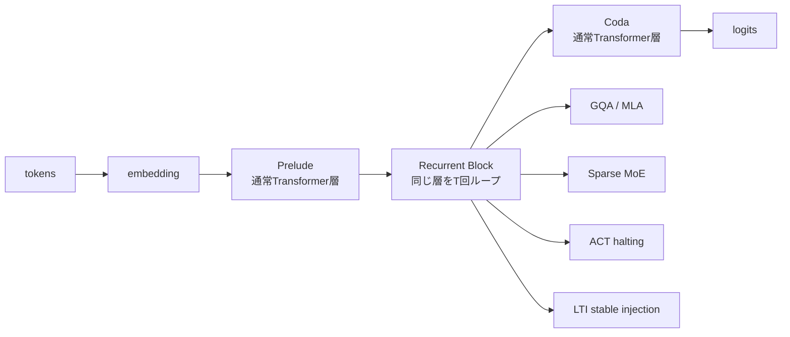

OpenMythosのREADMEは、自身を「公開研究と推測だけに基づく理論的再構成」と説明し、Anthropicとの関係がないことも明記しています[^openmythos-repo]。

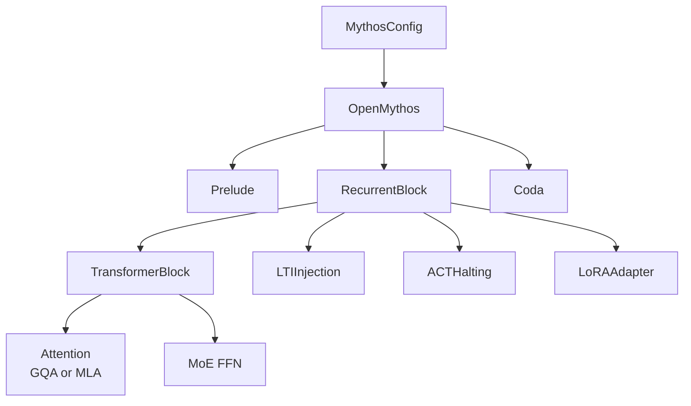

コード上も、中心は`Prelude → RecurrentBlock → Coda`です。`RecurrentBlock`は、同一のTransformerBlockを複数回使う設計として実装されています[^openmythos-main]。

---

## 4. 公式情報とOpenMythosを照合する

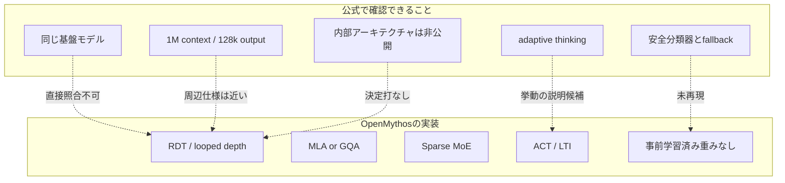

ここが重要です。Fable 5の公開情報は、性能・安全策・価格・入出力仕様が中心です。内部構造は出ていません。したがって、OpenMythosのRDT仮説が「本当に同じ」とは言えません。

---

## 5. 研究として筋がある部分

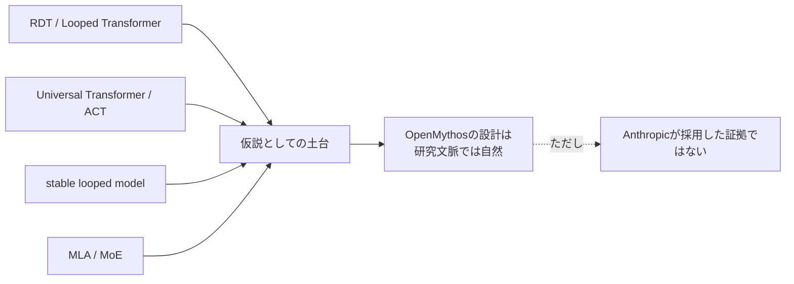

RDTは、同じTransformer層を反復して推論計算を増やす設計です。近年の研究では、反復回数を増やすことで深い推論に寄与する可能性が報告されています[^rdt-paper]。また、Universal TransformerのACT、安定なループモデル、MLA/MoEも既存研究・公開モデルに土台があります[^ut-paper][^parcae-paper][^deepseek-v2]。

---

## 6. 「正しいか」を5段階で見る

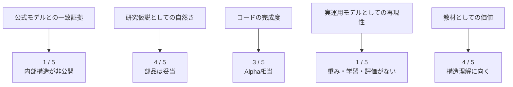

READMEの例には`mythos_7b()`が出ますが、`__init__.py`で公開されているvariantは`1b / 3b / 10b / 50b / 100b / 500b / 1t`です[^openmythos-init]。このような小さな不整合も、公式再現ではなく研究実装として扱うべき理由です。

---

## 7. 一番わかりやすいラベル

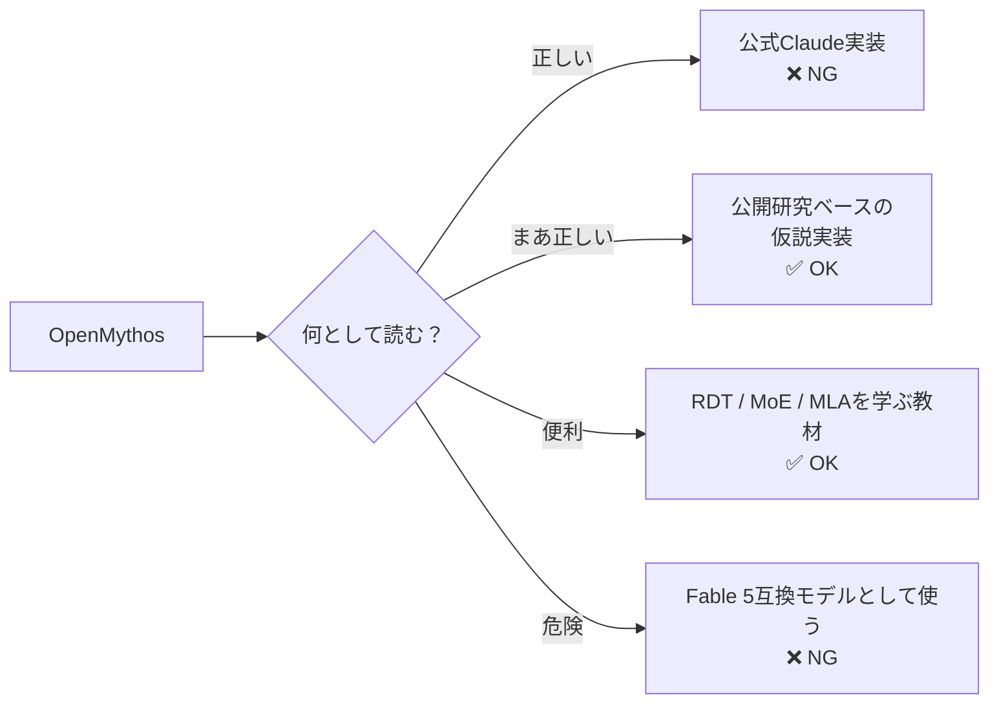

**結論:** OpenMythosは「Anthropicが作ったFable 5 / Mythos 5の正解」ではありません。けれど、Fable 5が見せる長時間・暗黙推論っぽい挙動を、RDTで説明しようとする仮説としては読みごたえがあります。

---

## 8. 読者が自分で確認する最短手順

```bash
git clone https://github.com/kyegomez/OpenMythos.git
cd OpenMythos

grep -R "class RecurrentBlock\|class LTIInjection\|class OpenMythos" -n open_mythos
```

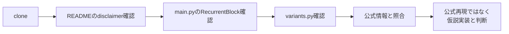

---

## 9. まとめ

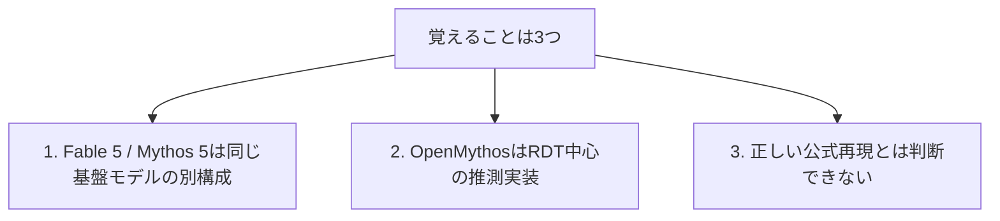

**一言で:** OpenMythosは「正解」ではなく「仮説地図」。本物の地形はAnthropicがまだ公開していません。

---

## 参考資料

[^anthropic-launch]: Anthropic, “Claude Fable 5 and Claude Mythos 5” https://www.anthropic.com/news/claude-fable-5-mythos-5
[^anthropic-fable]: Anthropic, “Claude Fable” https://www.anthropic.com/claude/fable
[^anthropic-mythos]: Anthropic, “Claude Mythos” https://www.anthropic.com/claude/mythos
[^anthropic-suspend]: Anthropic, “Statement on the US government directive to suspend access to Fable 5 and Mythos 5” https://www.anthropic.com/news/fable-mythos-access
[^claude-models]: Anthropic Claude Platform Docs, “Models overview” https://platform.claude.com/docs/en/about-claude/models/overview
[^claude-pricing]: Anthropic Claude Platform Docs, “Pricing” https://platform.claude.com/docs/en/about-claude/pricing
[^fable-prompting]: Anthropic Claude Platform Docs, “Claude Fable 5 のプロンプティング” https://platform.claude.com/docs/ja/build-with-claude/prompt-engineering/prompting-claude-fable-5
[^reuters-restore]: Reuters, “US close to allowing Anthropic to restore Fable 5 model, Axios reports” https://www.reuters.com/business/us-close-allowing-anthropic-restore-fable-5-model-axios-reports-2026-06-27/
[^openmythos-repo]: kyegomez/OpenMythos, GitHub repository https://github.com/kyegomez/OpenMythos
[^openmythos-main]: kyegomez/OpenMythos, `open_mythos/main.py` https://github.com/kyegomez/OpenMythos/blob/main/open_mythos/main.py
[^openmythos-init]: kyegomez/OpenMythos, `open_mythos/__init__.py` https://github.com/kyegomez/OpenMythos/blob/main/open_mythos/__init__.py
[^rdt-paper]: Harsh Kohli et al., “Loop, Think, & Generalize: Implicit Reasoning in Recurrent-Depth Transformers” https://arxiv.org/html/2604.07822v1
[^ut-paper]: Mostafa Dehghani et al., “Universal Transformers” https://arxiv.org/abs/1807.03819
[^parcae-paper]: “Parcae: Scaling Laws For Stable Looped Language Models” https://arxiv.org/abs/2604.12946
[^deepseek-v2]: DeepSeek-AI, “DeepSeek-V2: A Strong, Economical, and Efficient Mixture-of-Experts Language Model” https://arxiv.org/abs/2405.04434
