Goで `.s` ファイルを書くと、`TEXT ·Add(SB), NOSPLIT, $0-24` のような見慣れない記法に出会います。これは「Plan 9というOSそのものを使っている」という意味ではなく、Plan 9系アセンブラの入力スタイルを受け継いだ、Go専用アセンブラを使うという意味です。[^go-asm]

この記事では、細かい命令表よりも「なぜそう見えるのか」を図でつかみます。

## この記事の地図

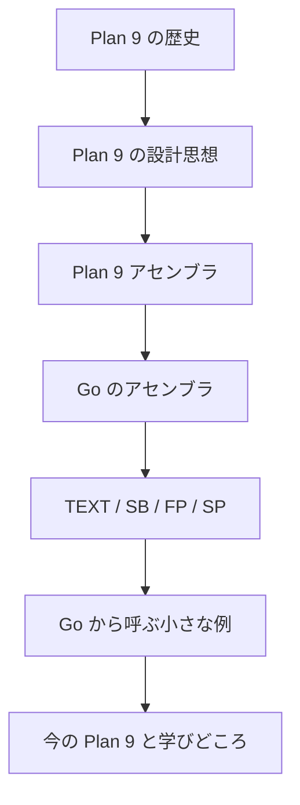

## Plan 9とは

Plan 9は、UnixやC言語を生んだBell Labsで1980年代後半から開発された研究用OSです。中心にある発想は「分散環境でも、資源をファイルのように扱えるようにする」ことです。プロセスごとの名前空間、9P、UTF-8、`rio`、`acme` などが特徴です。[^plan9-overview]

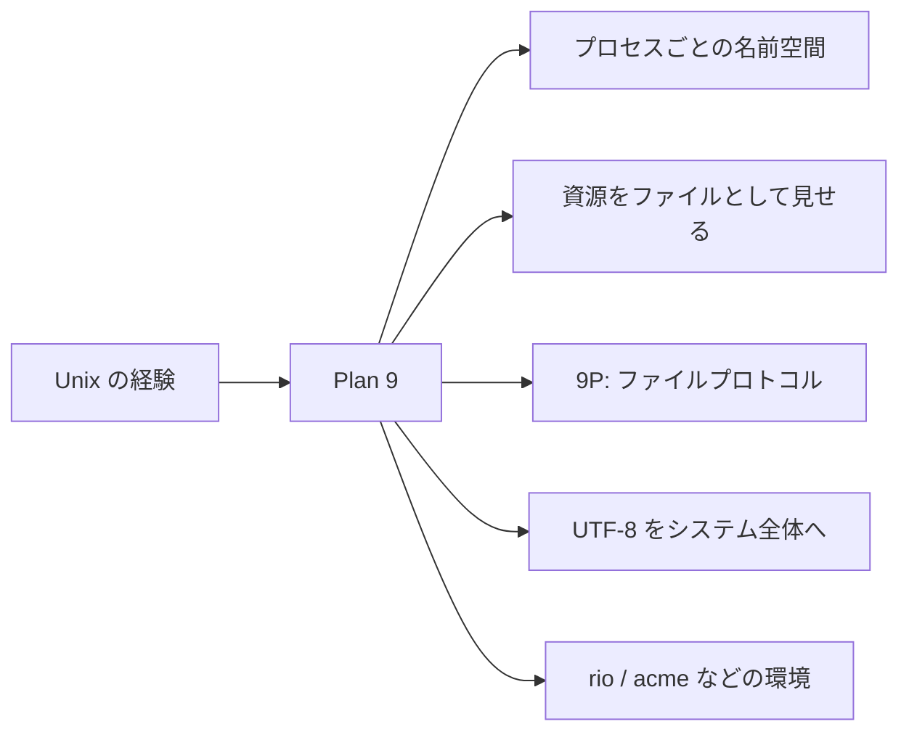

## 歴史をざっくり見る

Plan 9は「Unixの後継OS」というより、Unixで得たアイデアをネットワーク時代に向けて再設計した実験場でした。

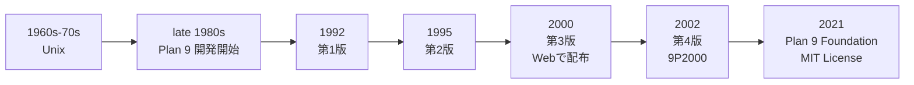

## UnixとPlan 9の見方の違い

Unixも「everything is a file」と言われますが、Plan 9はその考えをネットワーク、ウィンドウ、プロセス、認証などへさらに押し広げます。

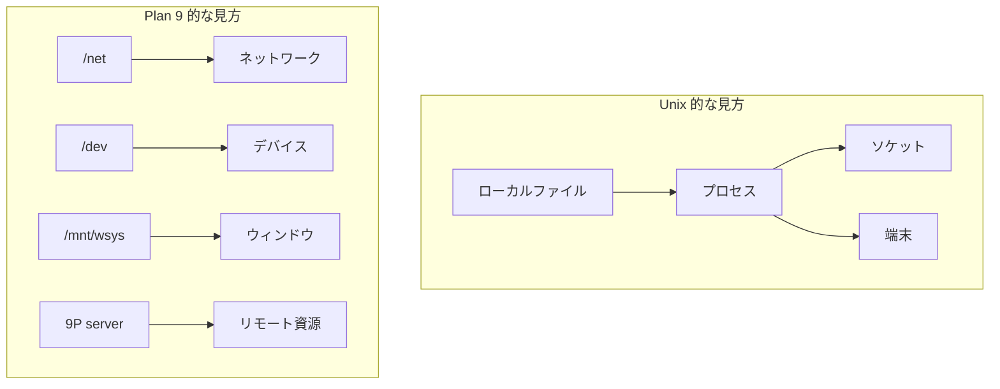

## 名前空間がプロセスごとに違う

Plan 9では、各プロセスが自分用の名前空間を持てます。同じ `/mnt/data` でも、プロセスAとBで別のファイルサーバを見せられます。

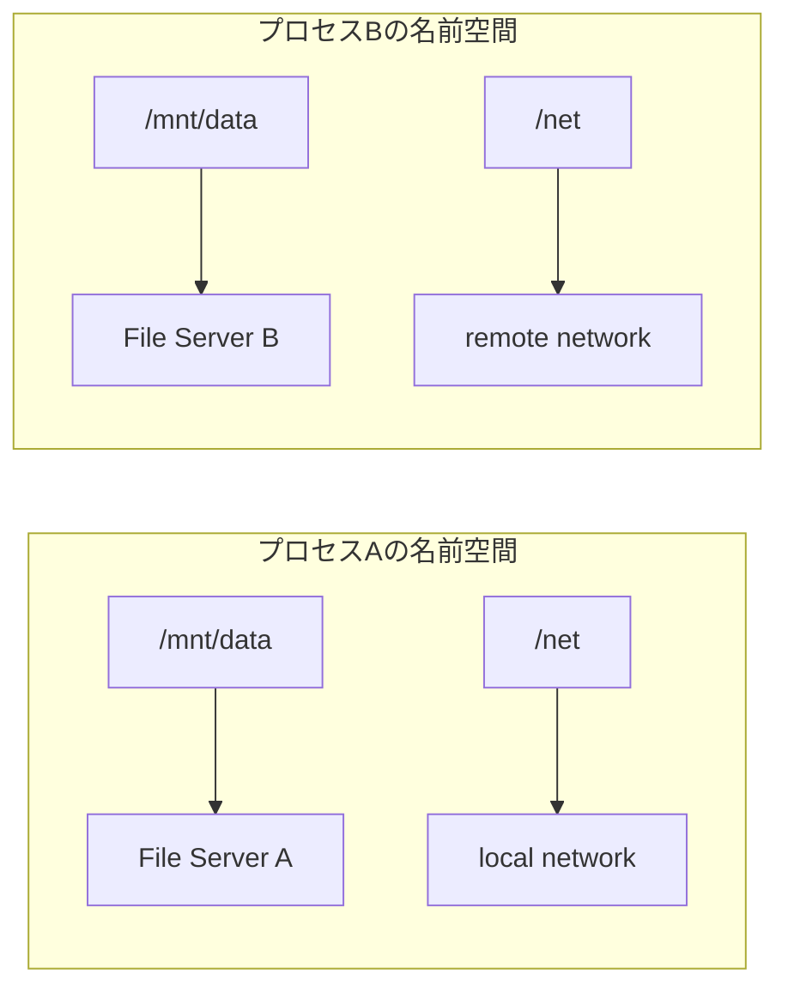

## 9Pの役割

9Pは「ファイルサーバと話すための小さな共通語」です。ローカルでもリモートでも、同じように `open/read/write` の感覚で扱えるのがPlan 9らしさです。

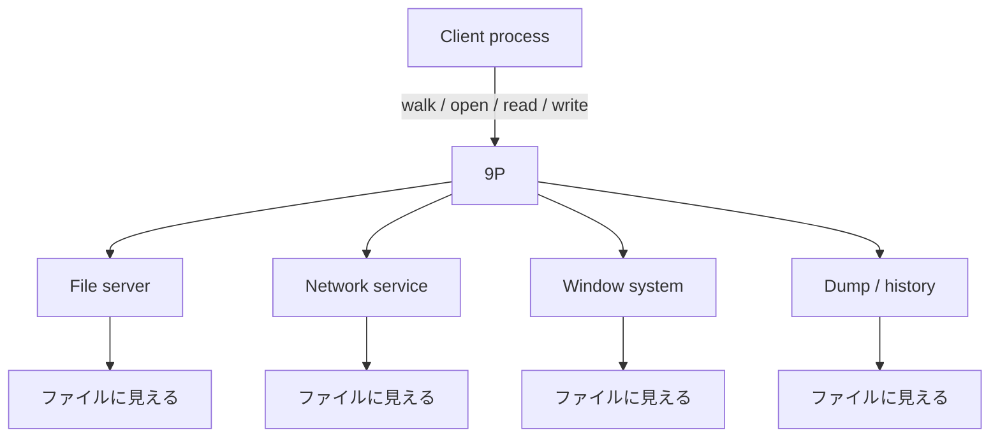

## Plan 9は今どうなったのか

Plan 9は主流デスクトップOSにはなりませんでした。一方で、公式系のコードはPlan 9 Foundationへ移り、2021年以降はMIT Licenseで公開されています。さらに、9frontなどのコミュニティフォークも継続しています。[^plan9-overview] [^ninefront]

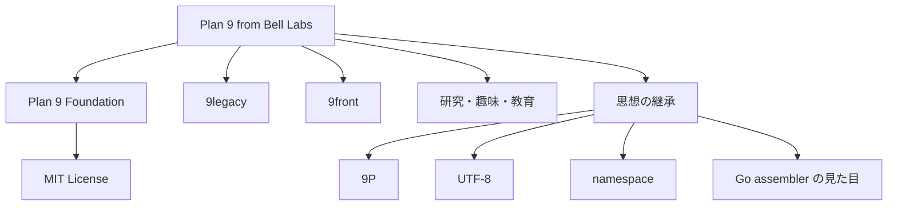

## Plan 9アセンブリとは

Plan 9アセンブラは、各CPUごとに別々のアセンブラを持ちながら、共通した書き方を持つように設計されました。Rob Pikeのマニュアルでは、複数アーキテクチャ向けアセンブラが「1つのプログラムのバリエーション」のように説明されています。[^p9-asm]

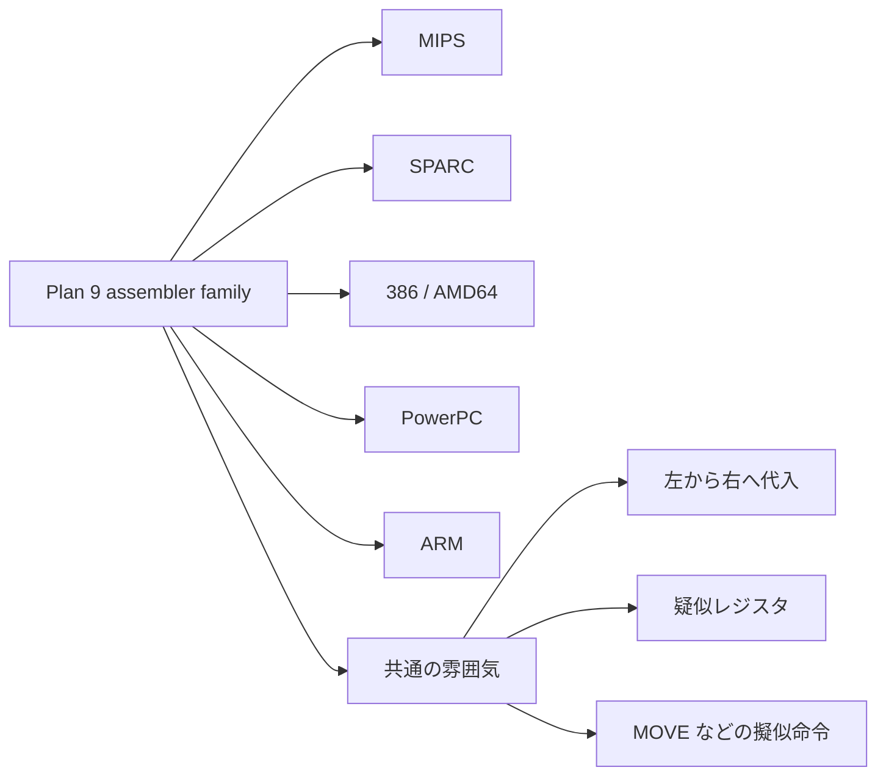

## GoのアセンブラはPlan 9そのものではない

GoのアセンブラはPlan 9アセンブラの入力スタイルをベースにしています。ただし、Goのツールチェーン用に作られた別プログラムであり、実CPU命令をそのまま書くというより、やや抽象化された命令列を扱います。[^go-asm]

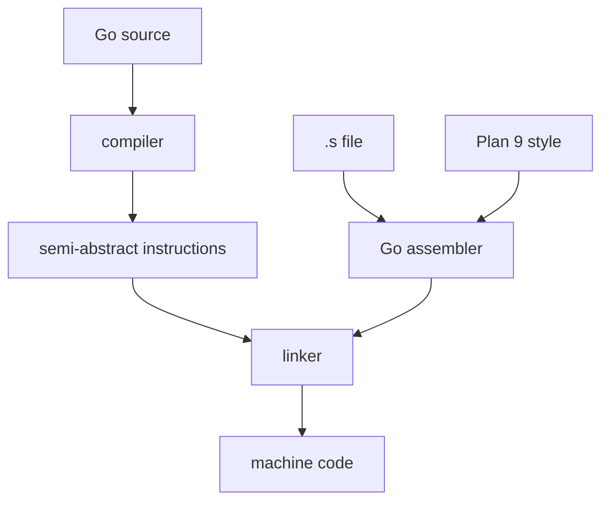

## なぜ見た目が独特なのか

Goアセンブリの独特さは、主にこの4つから来ます。

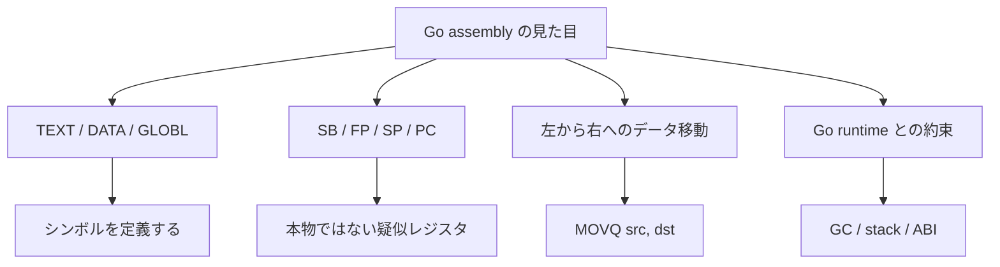

## `TEXT`行の読み方

最初に読むべき行は `TEXT` です。ここに「関数名」「スタック分割の扱い」「ローカルフレームサイズ」「引数と戻り値のサイズ」がまとまっています。

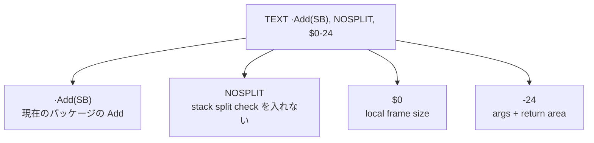

## 疑似レジスタを図で覚える

`SB`、`FP`、`SP`、`PC` は、CPUの物理レジスタというより、Goツールチェーンが管理する仮想的な目印です。

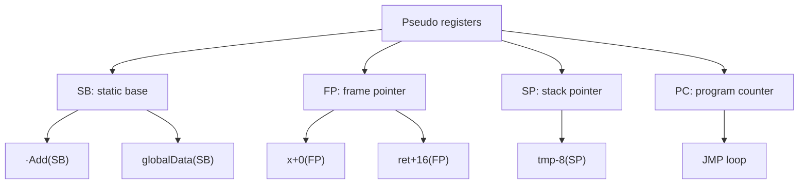

## `FP`まわりの見え方

たとえば `func Add(x, y uint64) uint64` をスタック引数として見ると、`x`、`y`、`ret` が `FP` からのオフセットとして並びます。

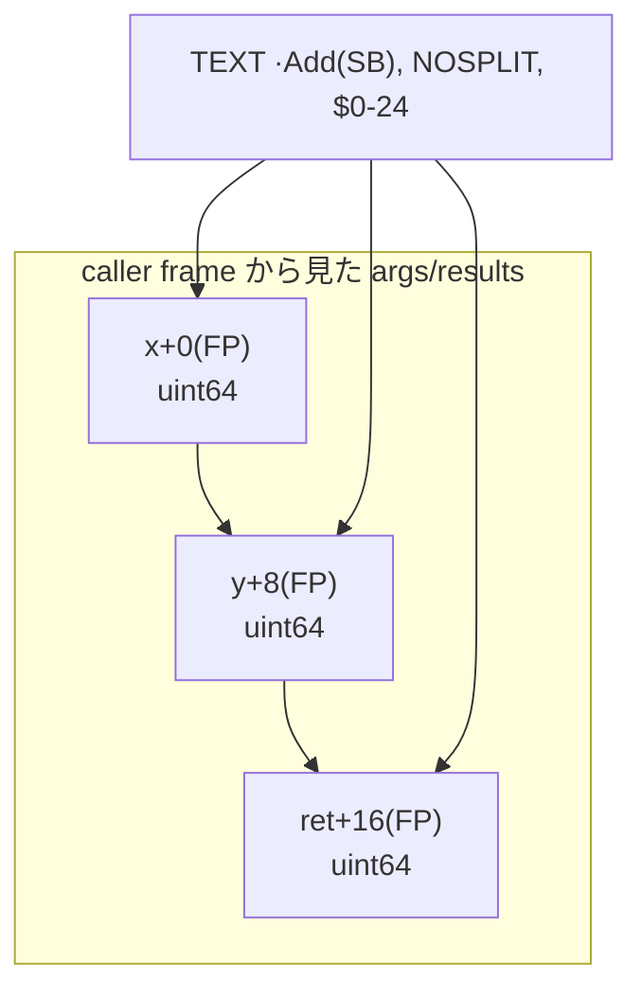

## 左から右へ読む

Plan 9系の書き方では、データ移動は「左がソース、右が宛先」と読むのが基本です。Intel記法に慣れていると最初に混乱しやすいところです。

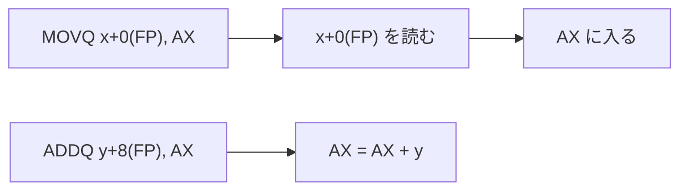

## Goから呼べる最小例

Go側には関数宣言だけを書き、実装を `.s` に置きます。Goのプロトタイプは、`go vet` のチェックやGCのための情報にも関係します。[^go-asm]

```go:add.go
package add

func Add(x, y uint64) uint64
```

```asm:add_amd64.s
#include "textflag.h"

TEXT ·Add(SB), NOSPLIT, $0-24
    MOVQ x+0(FP), AX
    ADDQ y+8(FP), AX
    MOVQ AX, ret+16(FP)
    RET
```

## この例の流れ

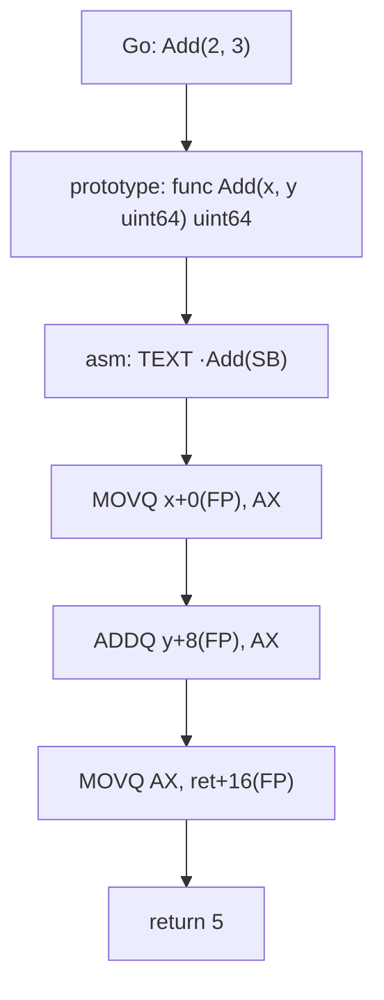

## `.go` と `.s` はビルド時に合流する

パッケージに `.s` ファイルがある場合、`go build` は `go_asm.h` を生成し、Goの定数・構造体サイズ・フィールドオフセットなどをアセンブリ側から参照できるようにします。[^go-asm]

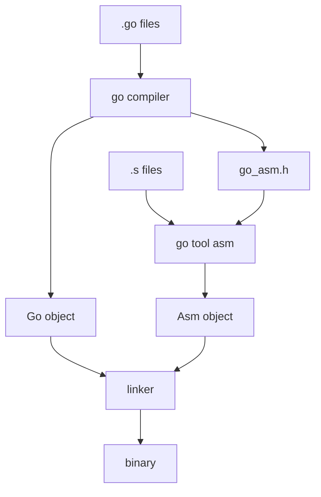

## `TEXT`、`DATA`、`GLOBL`の位置づけ

関数は `TEXT`、初期化付きデータは `DATA`、グローバルシンボル宣言は `GLOBL` で表します。

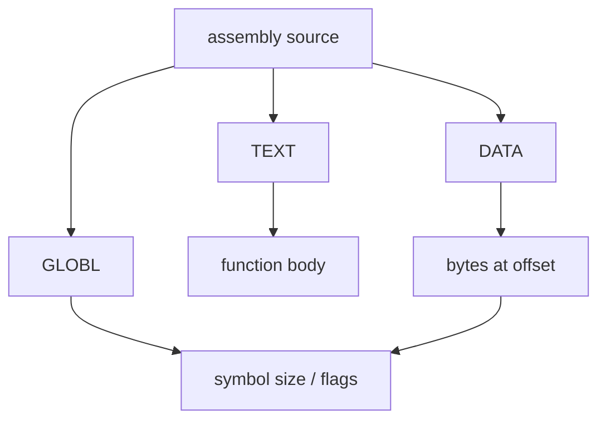

## GCとの約束

GoではGCがポインタ位置を知る必要があります。アセンブリはGoコンパイラの型安全な世界を一部抜けるので、「プロトタイプを書く」「ポインタを含まないデータには `NOPTR` を付ける」などの約束が重要です。[^go-asm]

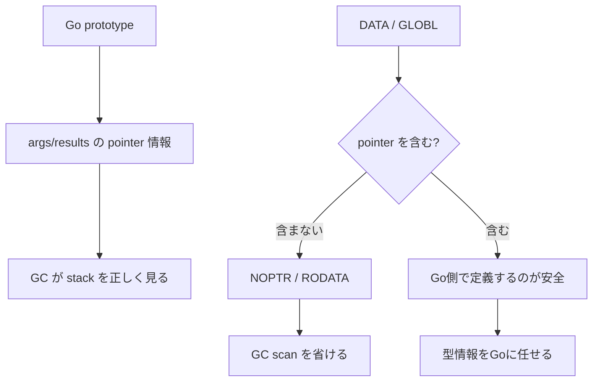

## どんな時に書くべきか

手書きアセンブリは強力ですが、読みやすさ・移植性・安全性を失いやすいです。基本はGoで書き、必要が明確な部分だけに閉じ込めるのが現実的です。

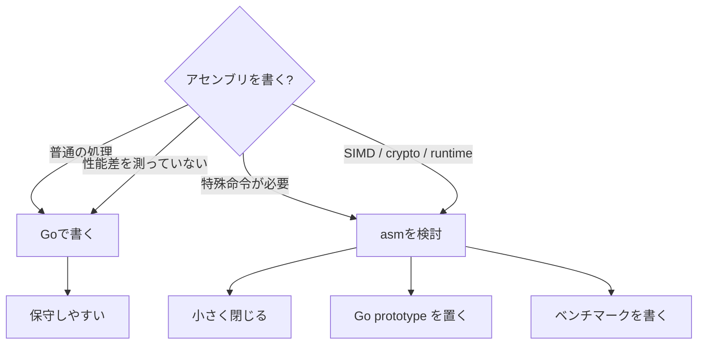

## Plan 9からGoへ、何が残ったのか

Plan 9の思想そのものがGoに丸ごと入っているわけではありません。しかし、低レイヤを見ると、Plan 9の「資源を単純なモデルで扱う」「ツールチェーンで抽象化する」という空気が残っています。

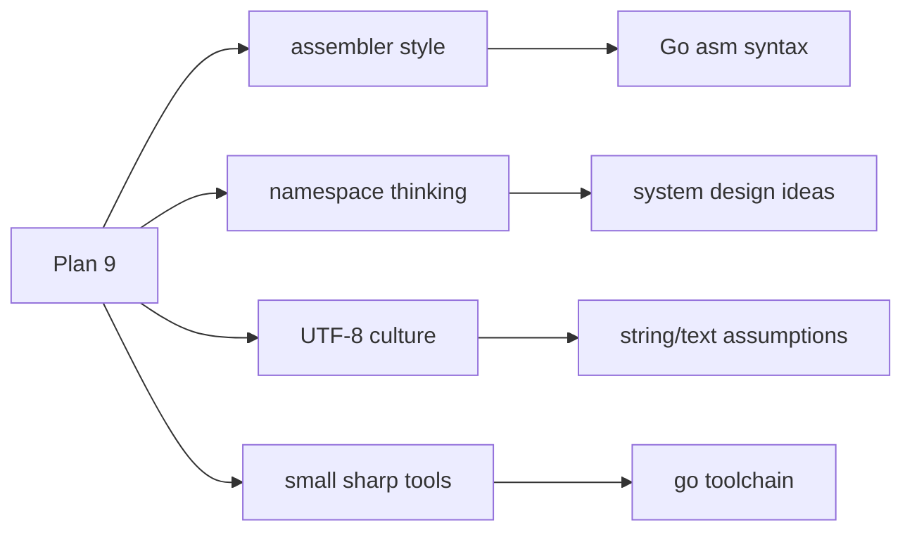

## まとめ

Plan 9アセンブリを理解するコツは、CPU命令から入るより先に、`TEXT`、`SB`、`FP`、`SP` という「Goツールチェーンとの約束」を読むことです。

```mermaid
flowchart TD
  A["Plan 9"] --> B["分散OSの実験"]
  A --> C["Plan 9 assembler"]
  C --> D["Go assembler の入力スタイル"]
  D --> E["TEXT / DATA / GLOBL"]
  D --> F["SB / FP / SP / PC"]
  D --> G["GC / stack との協調"]

  H["読む順番"] --> E
  E --> F
  F --> G
  G --> I["必要な部分だけ書く"]
```

「GoでPlan 9を使っている」という言い方は少し雑です。より正確には、GoのアセンブラにはPlan 9アセンブラ由来の表記と設計思想が残っている、という理解が近いです。

## 参考資料

[^plan9-overview]: Plan 9 Foundation / 9p.io, “Plan 9 from Bell Labs — Overview”. Plan 9の概要、リリース史、2021年以降のMIT License化、現在の状態について説明しています。https://9p.io/plan9/about.html
[^p9-asm]: Rob Pike, “A Manual for the Plan 9 assembler”. Plan 9アセンブラの疑似レジスタ、`SB`、左から右へのオペランド順などを説明しています。https://9p.io/sys/doc/asm.html
[^go-asm]: The Go Programming Language, “A Quick Guide to Go's Assembler”. GoアセンブラがPlan 9アセンブラの入力スタイルに基づくこと、疑似レジスタ、`TEXT`、`DATA`、`GLOBL`、GC連携などを説明しています。https://go.dev/doc/asm
[^ninefront]: OSNews, “9front Release released”, 2025-10-13. 9frontがPlan 9のメンテナンスされているフォークであり、2025年にもリリースがあったことを紹介しています。https://www.osnews.com/story/143526/9front-release-released/
