スマホやブラウザでAIモデルを動かすとき、速さを決めるのはGPUやNPUだけではありません。

**CPUの命令、キャッシュ、メモリ配置、スレッド分割まで使い切る**ことで、推論を高速化するライブラリがあります。それがGoogleのOSS、[XNNPACK](https://github.com/google/XNNPACK)です。

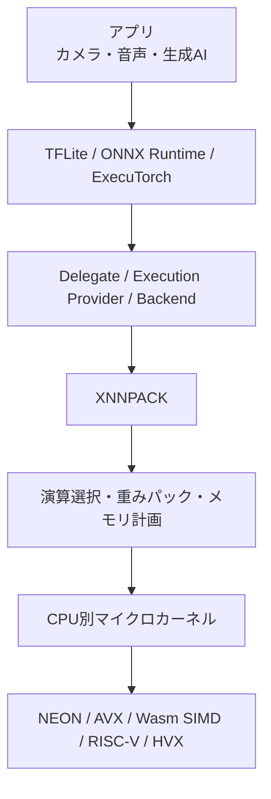

XNNPACKは学習フレームワークではなく、**上位ランタイムの下で動く低レイヤーのCPU推論エンジン**です。通常はC APIを直接叩くより、TensorFlow Lite、ONNX Runtime、ExecuTorchなどから利用します。

> 調査基準: XNNPACK `master` の [`231fbb10`](https://github.com/google/XNNPACK/commit/231fbb10cd237a15bff483d5094a090744fd2677)（2026年8月18日 JST時点）

## まず30秒で全体像

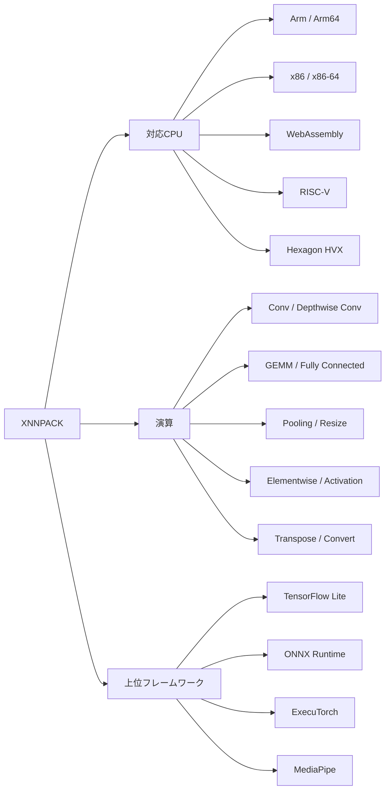

XNNPACKのREADMEには、Arm64、Armv7、Armv6、x86系、WebAssembly、RISC-V、Hexagonなどが挙げられています。演算も畳み込みだけではなく、行列積、プーリング、リサイズ、Softmax、各種活性化関数まで含みます。

ただし、**すべてのデータ型・演算・CPUの組み合わせが同じように高速化されるわけではありません**。実際の利用可否は上位フレームワークの対応範囲も含めて決まります。

## XNNPACKの速さは「1つの魔法」ではない


高速化の中心は次の組み合わせです。

- CPUに合ったマイクロカーネル
- GEMM / IGEMM / Depthwise Convなどの方式選択
- 重みのパッキングとキャッシュ
- SIMDに合うタイル分割
- 演算の融合
- スレッドプールによる並列化
- 中間テンソルのメモリ再利用

以降は、この流れを図で分解します。

## 1. 巨大な演算を「マイクロカーネル」に落とす

ニューラルネットワークの重い処理の多くは、最終的に行列積や畳み込みへ落ちます。しかし、巨大な行列をそのまま扱うのではありません。

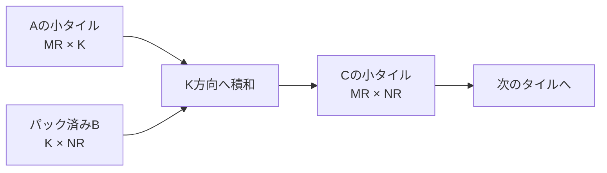

たとえば、XNNPACKの説明に登場する `2x4` のGEMMマイクロカーネルは、概念上、同時に8個の出力を更新します。

```text
A: 2行 × K列          B: K行 × 4列

[a0 ...]               [b0 b1 b2 b3]
[a1 ...]       ×       [   K方向    ]

                    ↓

C: 2行 × 4列の累積値
[c00 c01 c02 c03]
[c10 c11 c12 c13]
```

マイクロカーネル名を分解すると、設計思想がそのまま見えます。

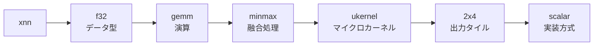

実際の [`xnn_f32_gemm_minmax_ukernel_2x4__scalar`](https://github.com/google/XNNPACK/blob/231fbb10cd237a15bff483d5094a090744fd2677/src/f32-gemm/gen/f32-gemm-2x4-minmax-scalar.c) は、8個の累積値を保持し、K方向へ積和し、最後にmin/maxでクランプしてから書き戻します。

## 2. 同じ演算でもCPUごとに別のカーネルを選ぶ

ArmのNEON、x86のAVX系、WebAssembly SIMDでは、使える命令もレジスタ幅も異なります。そこでXNNPACKは、実行環境を調べて適切な関数ポインタを設定します。

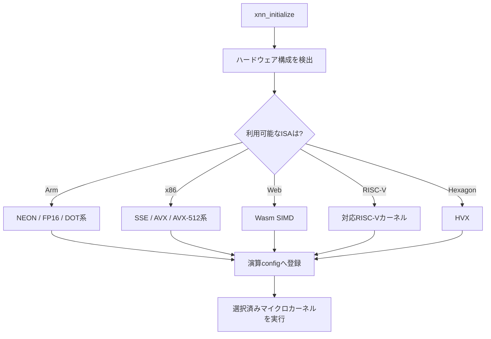

さらにArmでは、Cortex-A55などのマイクロアーキテクチャ別カーネルを選ぶコードもあります。つまり「Arm用が1個」ではなく、**CPUの特徴に合わせた細かな実装群**を持っています。

```text
同じ Conv / GEMM
      │
      ├─ Cortex-A55向け
      ├─ Arm64 NEON向け
      ├─ x86 AVX2向け
      ├─ x86 AVX-512向け
      ├─ Wasm SIMD向け
      └─ 最低限のscalar実装
```

この選択処理は [`src/init.c`](https://github.com/google/XNNPACK/blob/231fbb10cd237a15bff483d5094a090744fd2677/src/init.c) や [`src/configs/gemm-config.c`](https://github.com/google/XNNPACK/blob/231fbb10cd237a15bff483d5094a090744fd2677/src/configs/gemm-config.c) から追えます。

## 3. 畳み込みで巨大なim2colを作らない

一般的なGEMMベースの畳み込みでは、画像の各パッチを行列へ並べ直す `im2col` が使われます。


2×2カーネルなら、必要なのは画素のコピーではなく「どこを読むか」です。

```text
入力
A B C
D E F
G H I

左上の出力  -> [A, B, D, E] へのポインタ
右上の出力  -> [B, C, E, F] へのポインタ
左下の出力  -> [D, E, G, H] へのポインタ
右下の出力  -> [E, F, H, I] へのポインタ
```

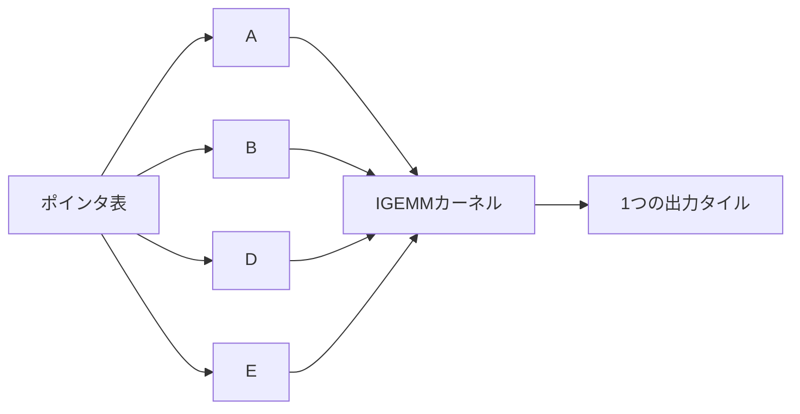

Indirect Convolutionは、入力をGEMM向けに丸ごと並べ替える代わりに、参照先を示す**indirection buffer**を使います。論文評価では、im2col変換を伴う条件でGEMMベース実装を最大62%上回りました。一方、1×1・stride 1のようにim2colが不要な条件では、小さな性能低下があり得るとも説明されています。

つまり、常にIGEMMを使うのではなく、カーネルサイズ、stride、paddingなどに応じてGEMMとIGEMMを選びます。

## 4. 重みを「CPUが読みやすい順番」に詰め直す

学習済みモデルの重み配置と、マイクロカーネルが高速に読みたい配置は同じとは限りません。

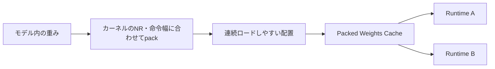

```text
通常の重み
[o0の全要素][o1の全要素][o2の全要素] ...

マイクロカーネル向けの例
[k0: o0 o1 o2 o3][k1: o0 o1 o2 o3] ...
          ↑ 4列をまとめて処理しやすい
```

`xnn_weights_cache_t` は、パック済みの重みを複数Runtimeで再利用するための仕組みです。毎回バラバラに重み領域を持つより、共有しやすくなります。

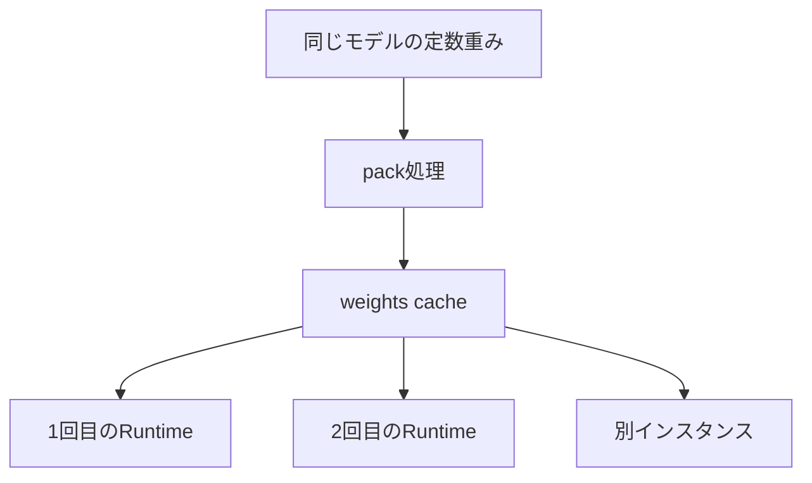

## 5. 生存期間が重ならないテンソルは同じメモリを使う

推論中の中間テンソルは、モデル全体が終わるまで必要とは限りません。

```text
演算番号       0   1   2   3   4   5

Tensor A      ███████
Tensor B          █████████
Tensor C                  ███████
Tensor D              █████

AとCは生存期間が重ならない
        ↓
同じ領域を再利用できる
```

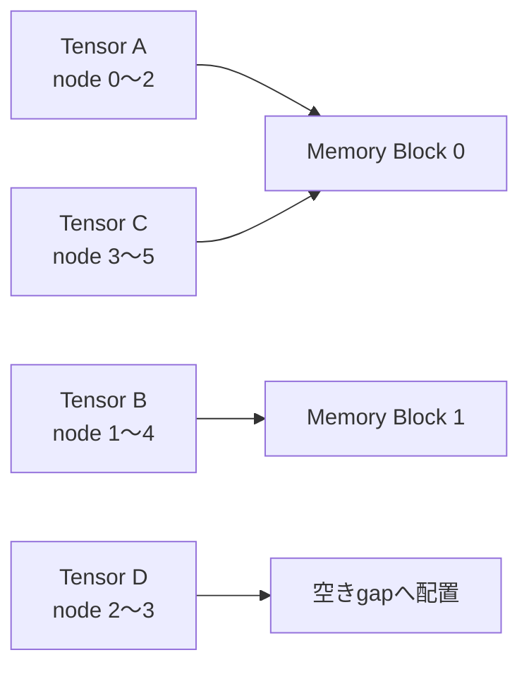

[`src/memory-planner.c`](https://github.com/google/XNNPACK/blob/231fbb10cd237a15bff483d5094a090744fd2677/src/memory-planner.c) では、テンソルの最初と最後の利用ノードを調べ、生存期間が重なる領域を避けながら、入る中で小さい空き領域を探します。

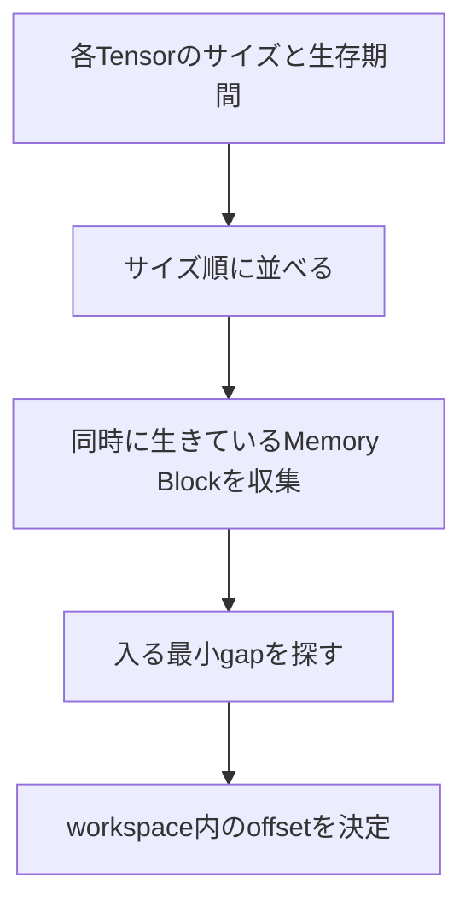

XNNPACKの `workspace` は内部テンソルの領域を保持し、複数Runtime間でも共有できます。関連論文では、中間バッファ共有の戦略により、当時の比較対象より最大11%小さいメモリ使用量が報告されています。

## 6. Convの後にReLUを「別処理」にしない

演算を分けると、中間結果をメモリへ書き、もう一度読み直す必要があります。


`xnn_f32_gemm_minmax_ukernel_2x4__scalar` の実装では、累積値に `max(vmin)` と `min(vmax)` を適用してから出力します。

```text
accumulate
   ↓
max(value, output_min)
   ↓
min(value, output_max)
   ↓
store
```

`minmax` は名前だけではなく、**メモリアクセスを増やさずに活性化・クランプを組み込む設計**です。

## 7. NHWCとChannel strideでSplit / Concatのコピーを減らす

XNNPACKのREADMEでは、演算はNHWCレイアウトを扱い、C方向にカスタムstrideを指定できると説明されています。

```text
NHWC Tensor

Pixel 0: [C0 C1 C2 C3 | C4 C5 C6 C7]
Pixel 1: [C0 C1 C2 C3 | C4 C5 C6 C7]
Pixel 2: [C0 C1 C2 C3 | C4 C5 C6 C7]

Branch A: 先頭アドレス + C0〜C3を見る
Branch B: 先頭アドレス + C4〜C7を見る

新しいSplit用Tensorへコピーしない
```

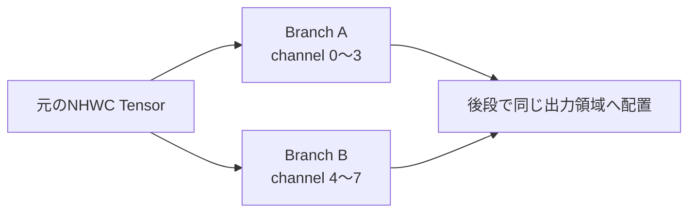

このため、対応するグラフではChannel Split / Concatenationを独立したコピー処理にせず、入力・出力の位置とstrideで表現できます。

## 8. 出力タイルをスレッドへ分配する

XNNPACKのRuntimeには `pthreadpool_t` を渡せます。`NULL` なら呼び出し元スレッドだけで実行されます。

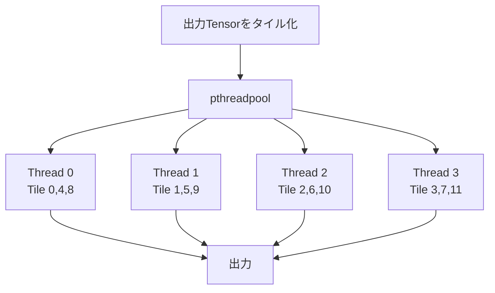

ただし、スレッド数は多ければ多いほどよいわけではありません。小さなモデルでは分割コストが勝ち、別のランタイムもスレッドプールを持つと競合します。

ONNX RuntimeのXNNPACK Execution Providerでは、重い演算がXNNPACKへ委譲される構成に対して、次の設定が推奨されています。

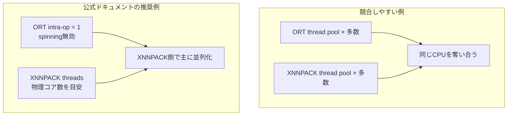

モデル内にXNNPACK非対応の重い演算が多い場合は、ORT側のスレッド設定も含めて再計測が必要です。

## 9. 上位フレームワークは対応部分だけを委譲する

「XNNPACKを使う」とは、多くの場合、モデル全体をXNNPACKへ渡すことではありません。対応するノードやサブグラフを切り出して実行します。

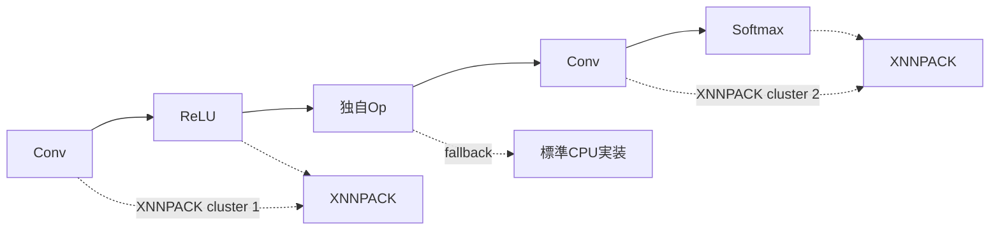

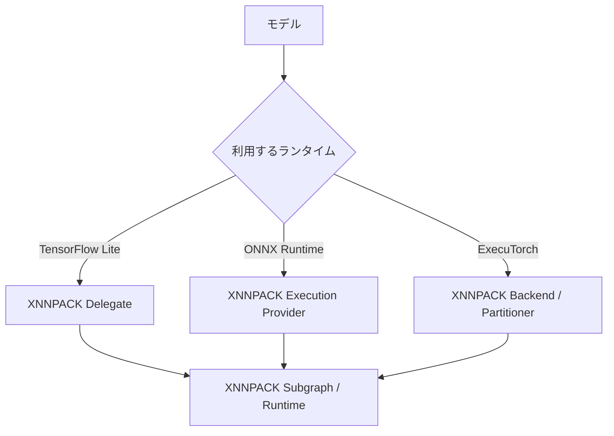

非対応演算があってもfallbackできる一方、グラフが細切れになると高速化の効果が薄れる場合があります。**対応演算数だけでなく、重い部分がまとまって委譲されているか**を見ることが重要です。

## 10. XNNPACK内部のRuntimeはどう動くのか

直接利用は低レイヤー向けですが、APIの流れを見ると内部構造を理解できます。

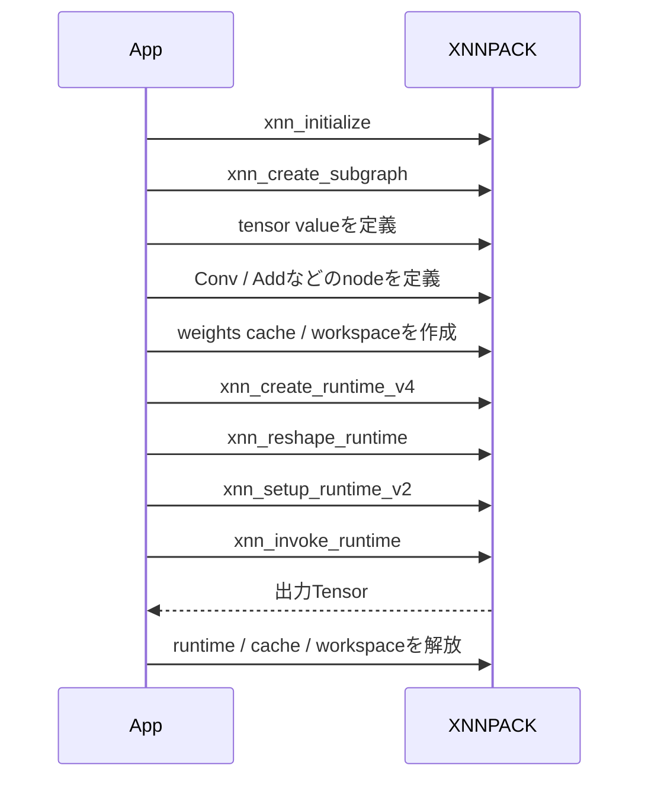

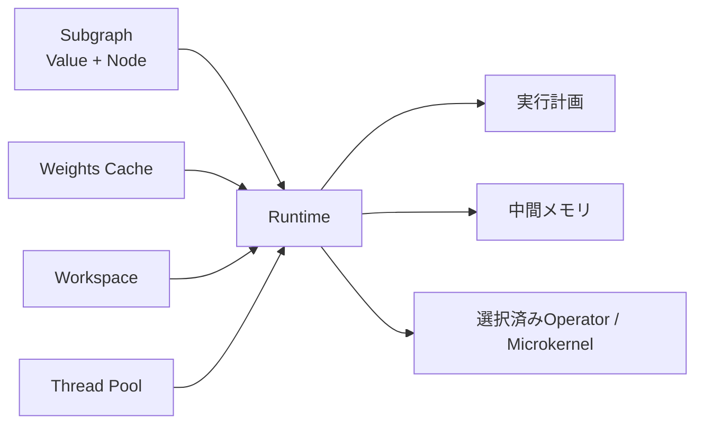

`xnn_runtime_t` は、サブグラフの実行計画とValue用メモリ管理を組み合わせたものです。`reshape → setup → invoke` を分けることで、shape変更、外部入出力ポインタの設定、実行を独立して扱えます。

## 11. 精度形式は「小さくすれば勝ち」ではない

```mermaid
graph LR
    A["FP32<br/>扱いやすい"] --> B["FP16 / BF16<br/>帯域と容量を削減"]
    B --> C["INT8系<br/>量子化"]
    C --> D["4bit / 2bit系の形式<br/>対応は限定的"]
```

XNNPACK本体のAPIにはFP32、FP16、BF16、複数の8bit量子化、さらに低bitの重み形式などが存在します。ただし、**その形式が特定の演算・CPU・上位バックエンドで利用できるかは別問題**です。

```mermaid
graph TB
    D["データ型"] --> O["演算が対応しているか"]
    O --> A["CPU命令が対応しているか"]
    A --> F["上位Frameworkがloweringできるか"]
    F --> B["実機で本当に速いか"]
```

たとえばExecuTorchの安定版概要ではFP32、FP16、8bit量子化が案内され、量子化ガイドでは対応するEmbeddingやLinearに2bit・4bit重みを使う構成も説明されています。低bit化できる範囲は演算ごとに異なるため、最終判断は実機ベンチマークです。

## リポジトリはこの順番で読むと分かりやすい

```mermaid
graph TB
    A["README.md<br/>役割・対応環境"] --> B["include/xnnpack.h<br/>公開API"]
    B --> C["src/subgraph.c<br/>グラフ表現"]
    C --> D["src/runtime.c<br/>実行計画・workspace"]
    D --> E["src/memory-planner.c<br/>中間メモリ再利用"]
    E --> F["src/configs/*<br/>CPU別カーネル選択"]
    F --> G["src/*-gemm / *-dwconv<br/>マイクロカーネル"]
    G --> H["bench / test<br/>測定と検証"]
```

```text
XNNPACK/
├── include/xnnpack.h       公開C API
├── src/subgraph.c          ValueとNode
├── src/runtime.c           Runtime、cache、workspace
├── src/memory-planner.c    メモリアリーナの割り当て
├── src/configs/            ISA・CPU別の実装選択
├── src/f32-gemm/           GEMMテンプレートと生成物
├── src/f32-dwconv/         Depthwise Conv実装
├── doc/                    マイクロカーネル解説
├── bench/                  ベンチマーク
├── test/                   テスト
├── scripts/                ビルド・生成スクリプト
└── tools/xngen             コード生成
```

生成済みマイクロカーネルには、次のようなヘッダーがあります。

```text
Auto-generated file. Do not edit!
Template:  src/f32-gemm/scalar.c.in
Generator: tools/xngen
```

大量のカーネルを手作業で複製するのではなく、テンプレートと列挙ファイルを使い、実装・テスト・ベンチマークを一貫して展開しやすい構成です。

## 手元でビルドする

XNNPACKはCMakeとBazelを主要なビルド方法として案内しています。ホスト環境向けなら、CMakeを呼び出すスクリプトが最短です。

```bash
git clone https://github.com/google/XNNPACK.git
cd XNNPACK
scripts/build-local.sh

cd build/local
ctest --output-on-failure
```

最低要件はC11、C++17、Python 3です。生成物や対応オプションが多いため、最初はライブラリ単体の速度より、`bench/` と上位ランタイムの両方で測るのがおすすめです。

## ベンチマークで見るべきもの

```mermaid
graph LR
    A["同じモデル・入力"] --> B["warm-up"]
    B --> C["thread数を固定"]
    C --> D["委譲されたOpを確認"]
    D --> E["median / p95 latency"]
    E --> F["peak memory"]
    F --> G["実機の温度・電力"]
```

```mermaid
graph TB
    Q{"速くならない"} --> A["非対応Opが多い?"]
    Q --> B["グラフが細切れ?"]
    Q --> C["thread poolが競合?"]
    Q --> D["小さすぎるモデル?"]
    Q --> E["量子化・layout変換が増えた?"]
    A --> R["profilingして再計測"]
    B --> R
    C --> R
    D --> R
    E --> R
```

READMEの性能表は、Pixel系が2020年、Raspberry Pi系が2022年の測定です。XNNPACKの仕組みを知る参考にはなりますが、2026年の端末・モデルへ数字をそのまま当てはめるべきではありません。

## まとめ

```mermaid
graph LR
    A["演算アルゴリズム"] --> Z["高速なCPU推論"]
    B["データlayout"] --> Z
    C["Packed Weights"] --> Z
    D["ISA別Microkernel"] --> Z
    E["Memory Planner"] --> Z
    F["Thread Pool"] --> Z
    G["Framework Delegation"] --> Z
```

XNNPACKの面白さは、派手な1つのアルゴリズムではなく、**CPUが嫌う無駄を1つずつ消していること**にあります。

- 不要なデータ変換を減らす
- キャッシュに合う形で重みを読む
- SIMD幅に合う小さなカーネルを選ぶ
- 中間結果の読み書きを融合する
- 生存期間が重ならないメモリを共有する
- 上位ランタイムから対応部分だけ受け取る

GPUやNPUが使えない場面でも、CPUの使い方を変えるだけで推論性能は変わります。XNNPACKは、その低レイヤー最適化を実用的な形で積み上げたリポジトリです。

## 参考資料

- [google/XNNPACK README](https://github.com/google/XNNPACK/blob/231fbb10cd237a15bff483d5094a090744fd2677/README.md)
- [XNNPACK Public C API](https://github.com/google/XNNPACK/blob/231fbb10cd237a15bff483d5094a090744fd2677/include/xnnpack.h)
- [Microkernel naming conventions](https://github.com/google/XNNPACK/blob/231fbb10cd237a15bff483d5094a090744fd2677/doc/microkernel-naming-conventions.md)
- [Depthwise convolution microkernels](https://github.com/google/XNNPACK/blob/231fbb10cd237a15bff483d5094a090744fd2677/doc/dwconv.md)
- [Building XNNPACK](https://github.com/google/XNNPACK/blob/231fbb10cd237a15bff483d5094a090744fd2677/BUILD.md)
- [The Indirect Convolution Algorithm](https://arxiv.org/abs/1907.02129)
- [Efficient Memory Management for Deep Neural Net Inference](https://arxiv.org/abs/2001.03288)
- [TensorFlow Lite XNNPACK delegate](https://github.com/tensorflow/tensorflow/blob/master/tensorflow/lite/delegates/xnnpack/README.md)
- [ONNX Runtime XNNPACK Execution Provider](https://onnxruntime.ai/docs/execution-providers/Xnnpack-ExecutionProvider.html)
- [ExecuTorch XNNPACK Backend](https://docs.pytorch.org/executorch/stable/ios-xnnpack.html)
- [ExecuTorch XNNPACK Quantization](https://docs.pytorch.org/executorch/stable/backends/xnnpack/xnnpack-quantization.html)
