## はじめに

プログラミング言語は、ソースコードをそのままCPUに渡しているわけではありません。多くの処理系では、まず文字列をtokenへ分け、構文を読み、ASTを作り、意味解析や最適化を行い、最終的に機械語・bytecode・JITコードなどへ変換します。

この記事では、EBNF、lexer、parser、AST、LLVM、そして C/C++・Go・Rust・Python・JavaScript がどのようにコードを処理しているかを、図を多めにしながら中くらいの深さまで見ていきます。

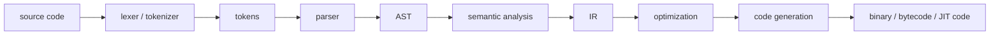

*図1：典型的な言語処理系の大まかな流れ*

最初に大事なのは、「コンパイル」という言葉を狭く捉えすぎないことです。Cを機械語へ変換するのもコンパイルですし、Pythonをbytecodeへ変換するのも、JavaScriptをJITで機械語へ変換するのも、広い意味ではコンパイルです。

見るべきポイントは、次の4つです。

| 観点 | 見ること |
| --- | --- |
| 入力と出力 | 何から何へ変換しているか |
| 解析の位置 | 型・名前・スコープをいつ解決するか |
| 中間表現 | AST、HIR、MIR、SSA、LLVM IR、bytecodeなど何を使うか |
| 実行方式 | native binary、VM、interpreter、JITのどれか |

## EBNF：文法を表すための道具

EBNF、Extended Backus-Naur Form は、プログラミング言語の文法を記述するためのメタ記法です。ISO/IEC 14977として標準化された記法もありますが、実際の言語仕様では少しずつ方言があります。

たとえば、簡単な式言語をEBNF風に書くとこうなります。

```ebnf
program     = { statement } ;
statement   = let_stmt | expr_stmt ;
let_stmt    = "let", identifier, "=", expression, ";" ;
expr_stmt   = expression, ";" ;

expression  = term, { ("+" | "-"), term } ;
term        = factor, { ("*" | "/"), factor } ;
factor      = number | identifier | "(", expression, ")" ;

identifier  = letter, { letter | digit | "_" } ;
number      = digit, { digit } ;
```

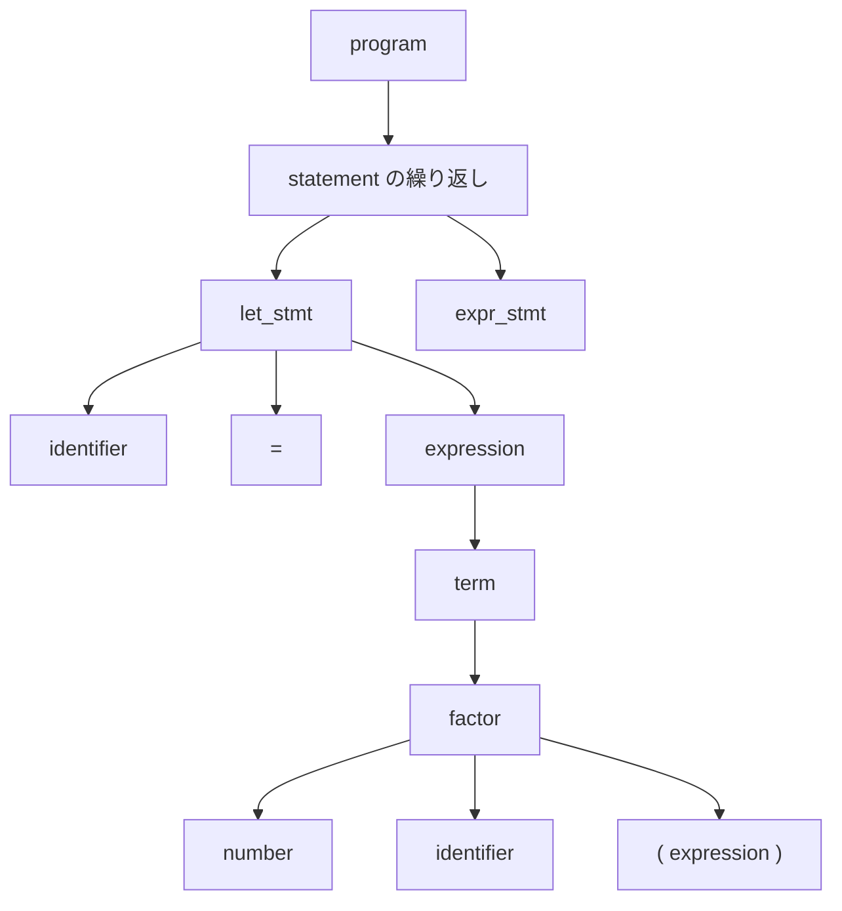

*図2：EBNFで書いた文法が表している構造*

ただし、EBNFで表せるのは主に「構文」です。

```text
let x = 1 + 2;
```

この文字列が「let文として正しい形か」はEBNFで表せます。しかし、`x` が再定義可能か、`1 + true` を許すか、関数呼び出しの引数の数が合っているか、といった話は通常parserの後のsemantic analysisで扱います。

## Lexer：文字列をtoken列に変換する

lexer/tokenizerは、ソースコードというただの文字列を、意味のある小片であるtokenに分けます。

```text
let x = 1 + 2 * 3;
```

これは、たとえば次のようなtoken列になります。

```text
LET("let")
IDENT("x")
EQUAL("=")
NUMBER("1")
PLUS("+")
NUMBER("2")
STAR("*")
NUMBER("3")
SEMICOLON(";")
EOF_TOKEN
```

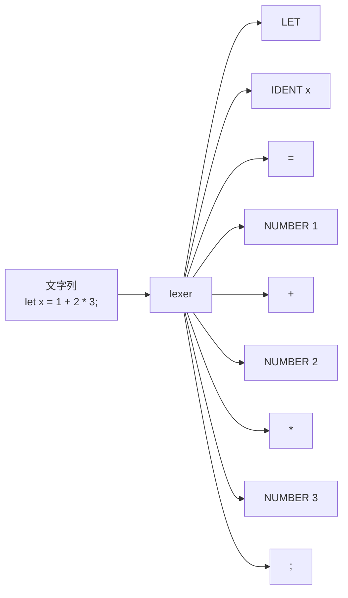

*図3：lexerは文字列をtoken列へ変換する*

lexerでよく出てくる考え方は、正規表現、有限オートマトン、longest matchです。たとえば `==` と `=` が両方ある言語では、`==` を1つのtokenとして優先的に認識しなければ、`=` と `=` に分解されてしまいます。

また、実用的なlexerではtokenの種類だけでなく、元の文字列と位置情報も持ちます。

```text
Token {
  kind: IDENT,
  text: "x",
  line: 1,
  column: 5
}
```

位置情報は、コンパイルエラー、IDEのhover、LSP、formatter、debug infoなどで重要になります。

## Parser：token列を構文木へ変換する

parserは、token列が文法に合っているかを確認しながら、構文木を作ります。

たとえば次の式を考えます。

```text
1 + 2 * 3
```

掛け算は足し算より優先順位が高いので、正しい構造は `1 + (2 * 3)` です。

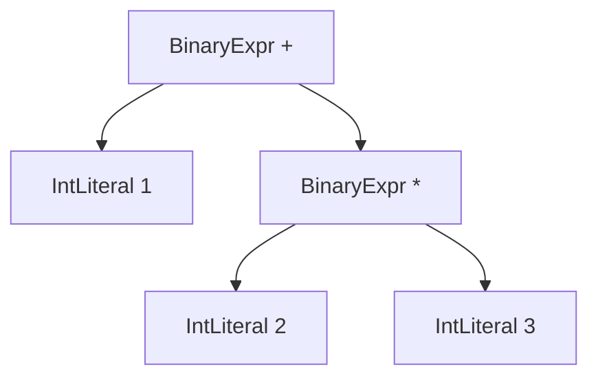

*図4：正しいAST。`1 + (2 * 3)` として読まれる*

もし単純に左から読んでしまうと、`(1 + 2) * 3` になり、意味が変わってしまいます。

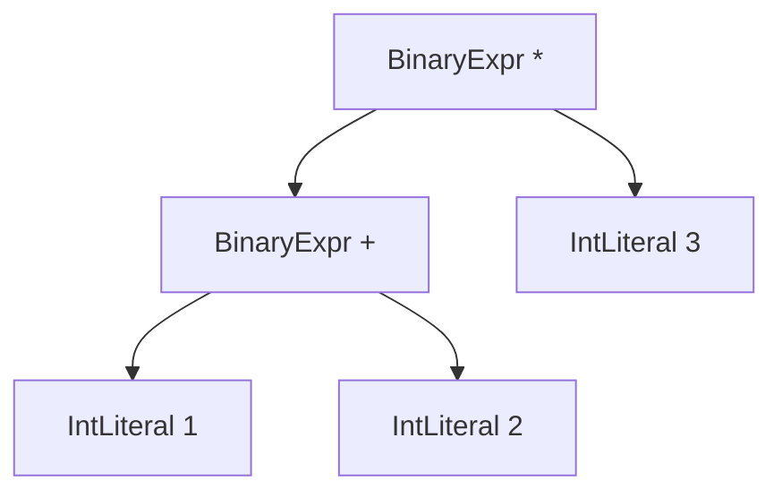

*図5：間違ったAST。`(1 + 2) * 3` として読まれてしまう*

### 式のparseでよく使われるPratt parser

式のparserでは、Pratt parser、precedence climbing、再帰下降parserなどがよく使われます。Pratt parserは、演算子の優先順位と結合規則を扱いやすい方法です。

```ts
function parseExpr(minBp = 0): Expr {
  let left = parsePrefix();

  while (true) {
    const op = peek();
    const bp = bindingPower(op);

    if (bp.left < minBp) break;

    consume(op);
    const right = parseExpr(bp.right);
    left = BinaryExpr(op, left, right);
  }

  return left;
}
```

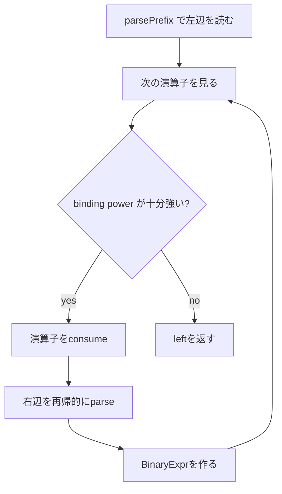

*図6：Pratt parserの基本ループ*

`*` のbinding powerを `+` より強くしておけば、`1 + 2 * 3` は自然に `1 + (2 * 3)` としてparseできます。

### Parser generatorを使う場合

手書きparserだけでなく、文法ファイルからparserを生成する方法もあります。

| 方式 | ざっくりした特徴 |
| --- | --- |
| LL / recursive descent | 左から読み、先読みしながら構文を決める。手書きしやすい |
| LR / LALR | shift/reduceで構文解析する。Yacc/Bison系でよく見る |
| PEG | 曖昧性を順序付き選択で解決する。packrat parsingと相性がよい |
| Pratt / precedence climbing | 式の優先順位を扱いやすい |

手書きparserはエラー回復やdiagnosticsを細かく制御しやすく、parser generatorは文法を一箇所に集約しやすい、という違いがあります。

## AST：ソースコードの「意味に近い構造」

AST、Abstract Syntax Treeは、ソースコードから不要な表面情報を落とし、コンパイラが扱いやすくした木構造です。

```text
let x = 1 + 2 * 3;
```

このコードは、ASTとして見ると次のようになります。

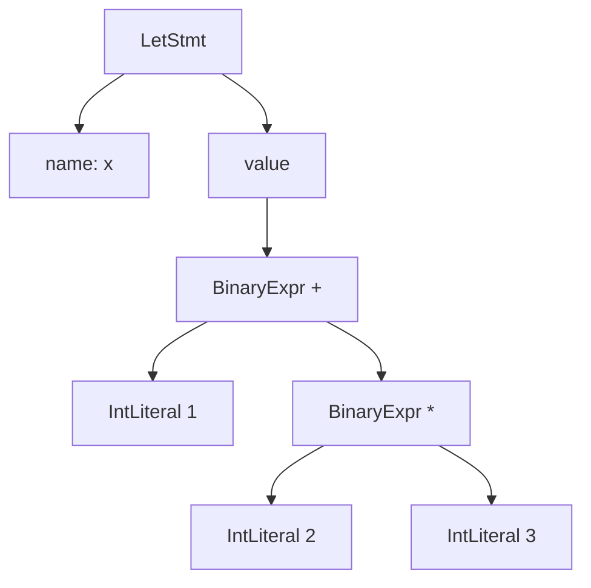

*図7：let文のAST例*

実装では、たとえば次のようなデータ構造になります。

```rust
#[derive(Debug, Clone)]
enum Expr {
    Int(i64),
    Name(String),
    Binary {
        op: BinaryOp,
        left: Box<Expr>,
        right: Box<Expr>,
    },
    Call {
        callee: Box<Expr>,
        args: Vec<Expr>,
    },
}

#[derive(Debug, Clone)]
enum Stmt {
    Let { name: String, value: Expr },
    ExprStmt(Expr),
    Return(Option<Expr>),
}
```

AST設計で大切なのは、「ソースに近い形を残すか」「処理しやすい形へ早めに変換するか」のバランスです。たとえば `for` 文をASTに残す設計もありますし、早い段階で `while` や低レベルなloop表現に変換する設計もあります。

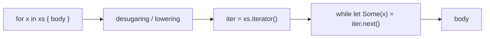

*図8：高級な構文を単純な内部表現へloweringする例*

## ASTを使う代表的なアルゴリズム

### 1. Visitorで木を走査する

ASTは木なので、基本は再帰的に走査します。formatter、linter、type checker、code generatorは、だいたいこの「木を歩く」処理の発展形です。

```ts
function visitExpr(expr: Expr) {
  switch (expr.kind) {
    case "Int":
      return;
    case "Name":
      resolveName(expr.name);
      return;
    case "Binary":
      visitExpr(expr.left);
      visitExpr(expr.right);
      return;
    case "Call":
      visitExpr(expr.callee);
      for (const arg of expr.args) visitExpr(arg);
      return;
  }
}
```

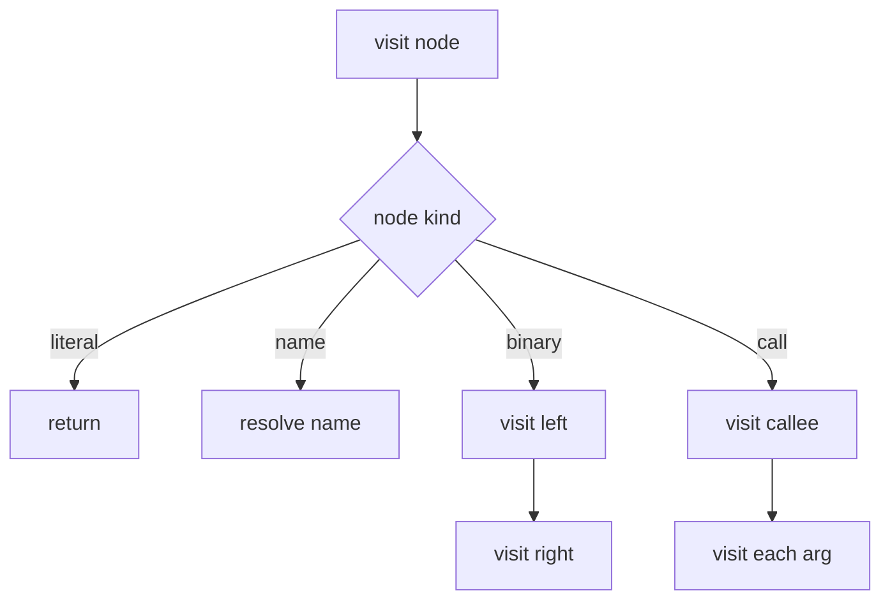

*図9：VisitorによるAST走査*

### 2. Symbol tableでスコープを管理する

名前解決では、スコープのstackを使うことが多いです。

```text
enter global scope
  let x = 1
  enter block scope
    let y = x + 1
  exit block scope
exit global scope
```

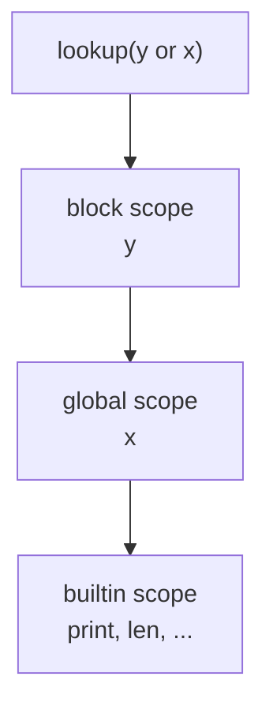

*図10：内側のスコープから外側へ名前を探す*

擬似コードにするとこうです。

```ts
class ScopeStack {
  scopes: Map<string, Symbol>[] = [];

  enter() { this.scopes.push(new Map()); }
  exit() { this.scopes.pop(); }

  define(name: string, symbol: Symbol) {
    this.scopes[this.scopes.length - 1].set(name, symbol);
  }

  lookup(name: string): Symbol | null {
    for (let i = this.scopes.length - 1; i >= 0; i--) {
      const found = this.scopes[i].get(name);
      if (found) return found;
    }
    return null;
  }
}
```

この段階で、未定義変数、二重定義、private symbolへのアクセス、module importの解決などを扱います。

### 3. Type checking

静的型付き言語では、ASTやHIRに型を付けていきます。

```text
1 + 2       => i32
"a" + "b"  => string
1 + true    => error
```

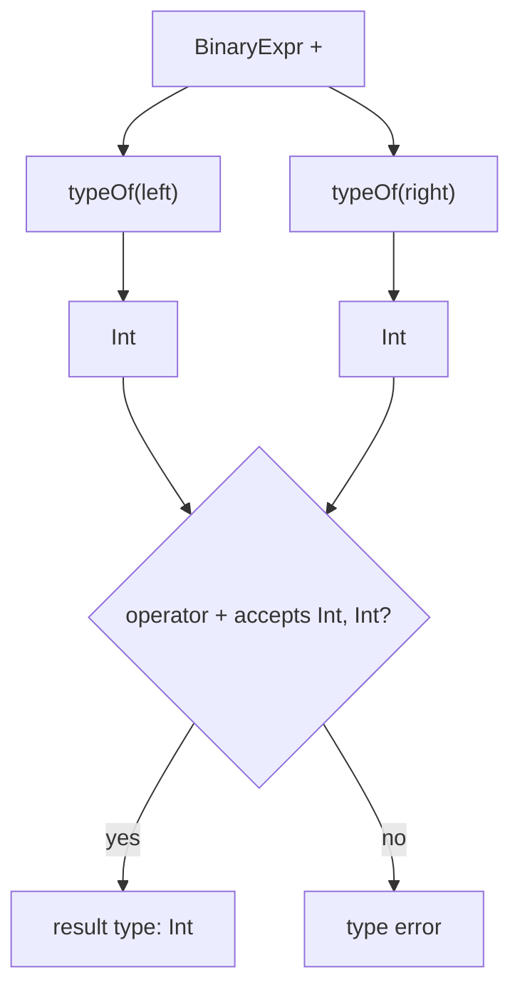

*図11：単純な二項演算の型検査*

本格的な言語になると、型推論、generics、trait/interface、lifetime、overload resolutionなどが入ります。Rustが難しいのは、型検査だけでなく所有権・借用・lifetimeをMIRレベルのflow-sensitiveな解析と絡めて扱うからです。

### 4. Constant folding

constant foldingは、コンパイル時に計算できる式を事前に計算してしまう最適化です。

```text
1 + 2 * 3
```

は、実行時に計算せず、次のように変換できます。

```text
7
```

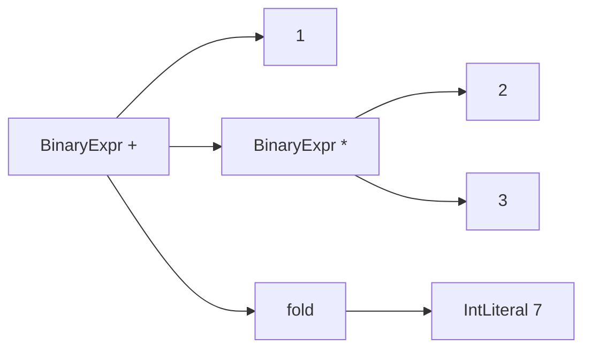

*図12：constant foldingのイメージ*

ただし、実際の言語では、overflow、浮動小数点、未定義動作、副作用、例外などを考慮する必要があります。`1 / 0` をコンパイル時にどう扱うかは、言語仕様によって変わります。

### 5. CFGとdataflow analysis

`if` や `while` のような制御構造を扱うには、ASTだけではつらくなります。そこでcontrol flow graph、CFGを使います。

```text
if cond {
  a()
} else {
  b()
}
c()
```

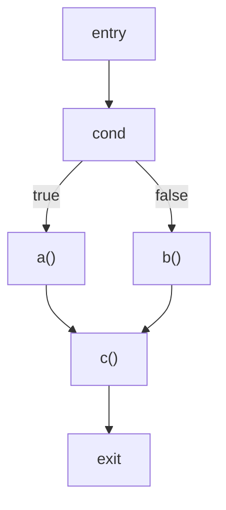

*図13：if文のCFG*

CFGにすると、到達不能コードの削除、変数が初期化済みかどうかの検査、liveness analysis、borrow check、register allocation、bounds check eliminationなどがやりやすくなります。

### 6. SSAとphi node

SSA、Static Single Assignmentは、「各値は一度だけ定義される」という形式です。

通常のコードでは、同じ変数に何度も代入できます。

```text
x = 1
if cond {
  x = 2
}
return x
```

SSA風にすると、値を別名に分けます。

```text
x1 = 1
if cond {
  x2 = 2
}
x3 = phi(x1, x2)
return x3
```

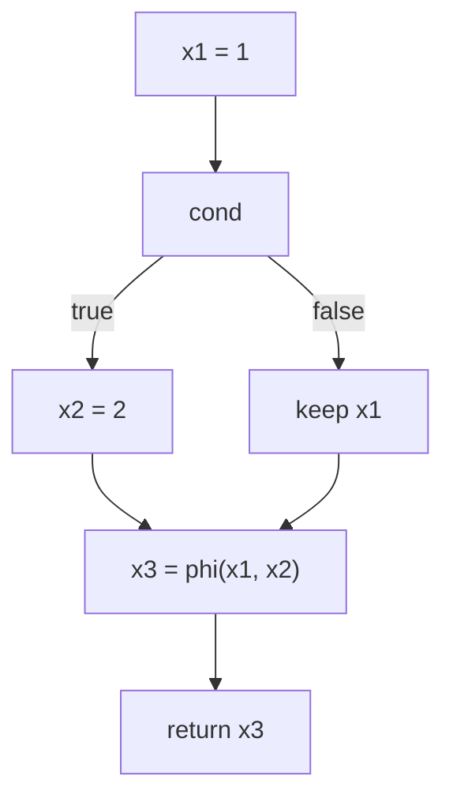

*図14：SSAのphi nodeは分岐後の値を合流させる*

SSAは、定数伝播、dead code elimination、common subexpression elimination、range analysisなどと相性がよいです。

## LLVM：自作言語の強い味方

LLVMは、コンパイラやツールチェーンを作るための巨大な基盤です。言語作者は、自分の言語をLLVM IRへ下げることができれば、その先の最適化や多くのCPU向けコード生成をLLVMに任せられます。


*図15：LLVMをbackendとして使う場合の典型的な流れ*

LLVM IRはSSAベースの低レベルな中間表現です。たとえば、2つの整数を足す関数は次のようになります。

```llvm
define i32 @add(i32 %a, i32 %b) {
entry:
  %sum = add i32 %a, %b
  ret i32 %sum
}
```

分岐と合流がある場合は、`phi` が出てきます。

```llvm
define i32 @select_i32(i1 %cond, i32 %a, i32 %b) {
entry:
  br i1 %cond, label %then, label %else

then:
  br label %merge

else:
  br label %merge

merge:
  %result = phi i32 [ %a, %then ], [ %b, %else ]
  ret i32 %result
}
```

LLVMを使うと、最適化pass、x86-64/AArch64/WebAssemblyなどのbackend、object file生成、JIT、debug infoなどの土台を利用できます。一方で、次のような言語固有の意味論はLLVMが自動で決めてくれるわけではありません。

| 言語側で決めること | 例 |
| --- | --- |
| 型システム | generics、trait、interface、overload |
| メモリモデル | GC、所有権、borrow、参照カウント |
| 名前解決 | module、import、visibility |
| runtime | panic、exception、stack map、reflection |
| lowering方針 | closure、async、pattern matchをどう下げるか |

LLVMは「強いbackend」ですが、frontendと言語設計の責任は残ります。

## C/C++はどうコンパイルされるか

C/C++は、古典的なAOTコンパイルパイプラインを学ぶうえで良い題材です。

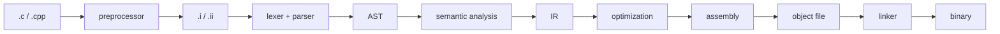

*図16：C/C++の典型的なコンパイルフロー*

C/C++で特徴的なのは、preprocessorとheaderの存在です。

```c
#define ADD(a, b) ((a) + (b))
#include <stdio.h>
```

preprocessorは、型やASTを理解した変換というより、テキスト処理に近い段階です。これがC/C++の柔軟さを支える一方で、diagnosticsやtoolingを難しくしている理由でもあります。

Clangの場合は、C/C++/Objective-C系のfrontendとしてソースをparseし、ASTとsemantic analysisを経てLLVM IRを生成し、LLVM側で最適化とcode generationを行います。C++ではさらに、template、overload、constructor/destructor、RAII、name mangling、ODR、inline展開などが絡むため、frontendが非常に重くなります。

## Goはどうコンパイルされるか

Goのコンパイラは、速いコンパイルと実用的なnative binary生成を重視しています。

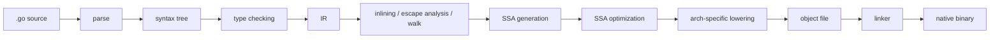

*図17：Goコンパイラの大まかな流れ*

Goで重要なのはSSA backendです。SSA上では、値は一度だけ定義され、何度でも使えるvalueとして扱われます。

たとえば、

```go
var c uint8 = a + b
```

はSSA風には次のようなvalueになります。

```text
v4 = Add8 <uint8> v2 v3
```

Goのコンパイラでは、nil check elimination、dead code elimination、bounds check elimination、register allocationなどがSSA上で行われます。また、escape analysisによって、値をheapに置くべきかstackに置けるかを判断します。

GoはGCを持つので、backendでは単に機械語を出すだけでなく、stack mapやpointer livenessなど、runtime/GCと連携する情報も重要になります。

## Rustはどうコンパイルされるか

Rustは、ASTから直接LLVM IRへ進むのではなく、複数のIRを通ります。

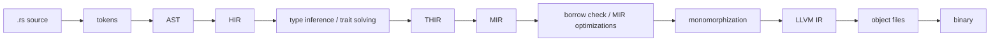

*図18：Rustコンパイラの大まかな流れ*

HIRは、ASTを少しコンパイラ向けにした高レベルIRです。構文糖衣がある程度展開され、型検査に向いた形になります。

MIRは、さらに制御フローグラフに近い中間表現です。MIRはborrow checkerや未初期化チェックなどのflow-sensitiveな解析と相性がよく、Rustの安全性を支える重要な層です。

Rustでgenericsを使うと、最終的には具体的な型ごとにコードを生成するmonomorphizationが行われます。

```rust
fn id<T>(x: T) -> T { x }

id::<i32>(1);
id::<bool>(true);
```

この例なら、`i32` 用と `bool` 用のように具体化されたコードが生成対象になります。その後、LLVM IRへ変換され、LLVM backendで最適化・機械語生成されます。

## Pythonはどう実行されるか

Pythonはよく「インタプリタ言語」と呼ばれますが、CPythonはソースコードを直接1文字ずつ実行しているわけではありません。ソースをtokenizeし、PEG parserでASTを作り、bytecodeへコンパイルしてからVMで実行します。

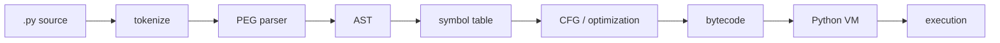

*図19：CPythonの大まかな流れ*

Pythonの `ast` moduleを使うと、PythonコードからASTを取り出せます。

```python
import ast

node = ast.parse("x = 1 + 2 * 3")
print(ast.dump(node, indent=2))
```

出力はだいたい次のような構造になります。

```text
Module(
  body=[
    Assign(
      targets=[Name(id='x', ctx=Store())],
      value=BinOp(
        left=Constant(value=1),
        op=Add(),
        right=BinOp(
          left=Constant(value=2),
          op=Mult(),
          right=Constant(value=3))))])
```

Pythonで重要なのは、多くの情報が実行時に決まることです。

```python
def add(a, b):
    return a + b
```

`a + b` が整数加算なのか、文字列結合なのか、独自クラスの `__add__` なのかは、実行時のobjectによって変わります。そのため、CやRustのようにコンパイル時に多くを静的に解決する言語とはかなり違います。

## JavaScriptはどう実行されるか

JavaScriptは、言語仕様として「この方式でコンパイルしなさい」と決めているわけではありません。ここではV8を例にします。

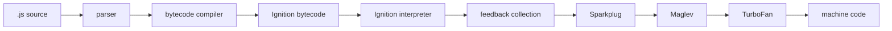

*図20：V8のtiered executionのイメージ*

V8では、まずJavaScriptをbytecodeへコンパイルし、Ignition interpreterで実行します。実行中に型やobject shapeなどのfeedbackを集めます。

短命な関数や初回実行では、最適化に時間を使いすぎると損です。そのためV8には、IgnitionとTurboFanの間を埋めるSparkplugという高速な非最適化compilerがあります。さらにMaglevは、SparkplugとTurboFanの間に位置する高速な最適化JITです。

JavaScriptエンジンで面白いのは、実行時feedbackに基づいて「たぶんこの型だろう」と仮定して速いコードを作り、仮定が外れたらdeoptimizationで戻るところです。

```mermaid
flowchart TD
    A["実行してfeedbackを集める"] --> B["shape / type が安定"]
    B --> C["仮定つきの速いコードを生成"]
    C --> D{"仮定が当たる?"}
    D -->|"yes"| E["高速に実行"]
    D -->|"no"| F["deopt"]
    F --> G["interpreter / lower tierへ戻る"]
```

*図21：JIT最適化とdeoptimization*

静的言語のAOT compilerと違い、JavaScriptエンジンはruntime情報を最大限使って最適化する点が特徴です。

## 各言語のコンパイル観を比較する

```mermaid
flowchart TB
    Source["source code"] --> Native["native binary"]
    Source --> VM["VM bytecode"]
    Source --> JIT["tiered JIT"]

    Native --> Cpp["C / C++"]
    Native --> Go["Go"]
    Native --> Rust["Rust"]
    VM --> Python["Python / CPython"]
    JIT --> JS["JavaScript / V8"]
```

*図22：言語ごとの実行モデルのざっくり分類*

| 言語 | 主な中間表現 | 実行モデル | 特徴 |
| --- | --- | --- | --- |
| C/C++ | AST、LLVM IR、GIMPLE/RTLなど | AOT native | preprocessor、header、linker、ABIが重要 |
| Go | syntax tree、IR、SSA | AOT native | コンパイル速度、GC連携、escape analysis、SSA backend |
| Rust | AST、HIR、THIR、MIR、LLVM IR | AOT native | borrow check、MIR、monomorphization、LLVM backend |
| Python/CPython | AST、CFG、bytecode | VM bytecode interpreter | 動的型、実行時dispatch、AST moduleで観察可能 |
| JavaScript/V8 | bytecode、JIT IR、machine code | interpreter + tiered JIT | runtime feedback、shape、deopt、tiering |

こうして見ると、同じ「コンパイル」でも、どこで何を解決するかが大きく違います。

- C/Rust/Goは、実行前に多くを解決してnative binaryを作る
- Pythonは、bytecodeへ変換してVMで動かす
- JavaScriptは、bytecode interpreterと複数段JITを組み合わせる
- LLVMを使う言語は、backendと最適化の多くを共通基盤に任せられる

## 小さな言語を作るなら、どこから始めるべきか

自作言語を作る場合、最初からRustやC++のような巨大な言語を目指すと大変です。おすすめは、次のような小さなsubsetから始めることです。

```text
整数
四則演算
変数定義
if
while
関数定義
関数呼び出し
return
```

このくらいでも、compilerの基本要素はかなり出てきます。

```mermaid
flowchart LR
    A["lexer"] --> B["parser"]
    B --> C["AST"]
    C --> D["symbol table"]
    D --> E["type checking"]
    E --> F["IR / CFG"]
    F --> G["LLVM IR"]
    G --> H["native binary"]
```

*図23：小さな自作言語でも通ることになる道*

最初のゴールは、たとえばこれです。

```text
fn add(a: i32, b: i32) -> i32 {
  return a + b;
}

fn main() -> i32 {
  return add(1, 2);
}
```

これをLLVM IRに落として、`llc` や `clang` 経由でnative binaryにできれば、言語処理系の骨格がかなり見えてきます。

小さく始めるときの順番は、次のようにすると進めやすいです。

| 段階 | ゴール |
| --- | --- |
| 1 | 整数リテラルと四則演算をparseできる |
| 2 | ASTを評価して結果を返せる |
| 3 | 変数、スコープ、symbol tableを追加する |
| 4 | 型を追加し、型エラーを出せるようにする |
| 5 | if/whileを入れてCFGを意識する |
| 6 | 独自IRまたはLLVM IRへloweringする |
| 7 | 最適化とcode generationを増やす |

## まとめ

プログラミング言語の処理系は、次のような層に分けて見ると理解しやすいです。

```mermaid
flowchart LR
    A["grammar / EBNF"] --> B["lexer"]
    B --> C["parser"]
    C --> D["AST"]
    D --> E["semantic analysis"]
    E --> F["HIR / MIR / CFG / SSA / bytecode"]
    F --> G["optimization"]
    G --> H["codegen / VM / JIT / linker"]
```

*図24：言語処理系を読むための地図*

LLVMは、このうち特に「低レベルIR以降」を強力に支えてくれます。しかし、lexer、parser、AST、型検査、名前解決、所有権、module system、runtime設計などは、言語作者が向き合う必要があります。

Go、Rust、C/C++、Python、JavaScriptを並べると、同じ「コンパイル」という言葉の中にもかなり違う設計思想があることが分かります。

| 言語 | 重要ポイント |
| --- | --- |
| C/C++ | preprocessor、AST/Sema、linker、ABI |
| Go | シンプルさ、速いコンパイル、SSA backend、runtime/GC連携 |
| Rust | HIR/MIR、borrow check、monomorphization、LLVM連携 |
| Python | ASTからbytecodeへ変換し、VMで動的に実行する |
| JavaScript | bytecode interpreterとtiered JITでruntime feedbackを活用する |

普段書いている `if` や `for` や `fn` は、内部では木、グラフ、SSA、IR、機械語へ姿を変えていきます。この視点を持つと、コンパイルエラー、最適化、ランタイム性能、型システム、LSPの仕組みまで、かなり立体的に理解できるようになります。

## 参考資料

- [ISO/IEC 14977:1996 - Syntactic metalanguage / Extended BNF](https://www.iso.org/standard/26153.html)
- [LLVM Project Overview](https://llvm.org/)
- [LLVM Language Reference Manual](https://llvm.org/docs/LangRef.html)
- [Clang: a C language family frontend for LLVM](https://clang.llvm.org/)
- [GCC Manual: Options Controlling the Kind of Output](https://gcc.gnu.org/onlinedocs/gcc/Overall-Options.html)
- [Go compiler README: cmd/compile](https://github.com/golang/go/blob/master/src/cmd/compile/README.md)
- [Go compiler SSA README](https://github.com/golang/go/blob/master/src/cmd/compile/internal/ssa/README.md)
- [Rust Compiler Development Guide: Overview](https://rustc-dev-guide.rust-lang.org/overview.html)
- [Rust Compiler Development Guide: MIR](https://rustc-dev-guide.rust-lang.org/mir/index.html)
- [CPython InternalDocs: Compiler design](https://github.com/python/cpython/blob/main/InternalDocs/compiler.md)
- [Python ast module documentation](https://docs.python.org/3/library/ast.html)
- [V8: Firing up the Ignition interpreter](https://v8.dev/blog/ignition-interpreter)
- [V8: Sparkplug — a non-optimizing JavaScript compiler](https://v8.dev/blog/sparkplug)
- [V8: Maglev - V8’s Fastest Optimizing JIT](https://v8.dev/blog/maglev)
